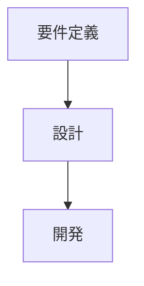

# design-docs-for-claude-code プロジェクト設定

## プロジェクト概要

このプロジェクトは、LLM（特にClaude Code）で効率的に編集できる設計書テンプレート集を提供します。

**リポジトリ**: https://github.com/pon-tanuki/design-docs-for-claude-code

## 言語設定

- すべてのドキュメントは日本語で記述
- コード例はTypeScript/JavaScriptを優先
- コメントも日本語

## プロジェクト構成

```
.
├── README.md                    # メインドキュメント
├── setup-docs.sh               # インタラクティブセットアップスクリプト
├── quick-setup.sh              # クイックセットアップスクリプト
├── templates/                  # テンプレートファイル
│   ├── 01_planning/           # 計画フェーズ
│   ├── 02_design/             # 設計フェーズ
│   ├── 03_development/        # 開発フェーズ
│   ├── 04_testing/            # テストフェーズ
│   ├── 05_operation/          # 運用フェーズ
│   └── 06_common/             # 共通ドキュメント
└── examples/                   # 利用者向けClaude Code設定サンプル
    └── .claude/               # Claude Code設定ファイル
```

## テンプレート編集ルール

### 必須事項

#### ドキュメント情報セクション
すべてのテンプレートファイルには以下のセクションが必要：
```markdown
## ドキュメント情報

- **作成日**: YYYY-MM-DD
- **最終更新日**: YYYY-MM-DD
- **バージョン**: X.Y.Z
- **作成者**: [あなたの名前]
- **プロジェクト**: [プロジェクト名]
- **ステータス**: Draft
```

#### 目次
すべてのテンプレートに目次を含める

#### 変更履歴
ドキュメント末尾に変更履歴テーブルを含める：
```markdown
## 変更履歴

| バージョン | 日付 | 変更者 | 変更内容 |
|-----------|------|--------|----------|
| 1.0.0     | YYYY-MM-DD | [名前] | 初版作成 |
```

### フォーマット規則

#### 見出し階層
- H1（#）は1回のみ（ドキュメントタイトル）
- H2→H3→H4の順で階層化
- 見出しレベルをスキップしない

#### コードブロック
必ず言語指定を行う：
```typescript
// ✅ Good
const example = "code";
```

```
// ❌ Bad - 言語指定なし
const example = "code";
```

#### Mermaid図
複雑な概念はMermaid図で視覚化：
- フローチャート（flowchart）
- シーケンス図（sequenceDiagram）
- ER図（erDiagram）
- クラス図（classDiagram）

日本語ラベルを使用：


#### プレースホルダー
テンプレートでは以下のプレースホルダーを使用：
- `[プロジェクト名]`
- `[あなたの名前]`
- `YYYY-MM-DD`（日付）
- `[X]`（数値や金額）

### コード例

#### 実践的なコード
- コピペで動作するコード例を提供
- TypeScript/JavaScriptを優先
- 適切なコメントを含める

#### 技術スタック
テンプレートで想定する技術スタック：
- **フロントエンド**: Next.js, React, TypeScript
- **バックエンド**: Node.js, Express, NestJS
- **データベース**: PostgreSQL, Prisma
- **インフラ**: Vercel, Railway, Supabase

#### コスト前提
- 月額$25程度のインフラ（現実的な小規模プロジェクト）
- 無料枠を活用
- スモールスタート

## スクリプトファイル

### setup-docs.sh
- インタラクティブなセットアップスクリプト
- ユーザーとの対話形式
- Bash 4.0以上を想定

### quick-setup.sh
- 非インタラクティブなクイックセットアップ
- 環境変数でカスタマイズ可能
- CI/CDでも使用可能

### スクリプト作成時の注意
- `set -e` でエラー時に停止
- 適切なエラーハンドリング
- カラー出力で視認性向上
- 実行権限を付与（chmod +x）

## Git コミットルール

### Conventional Commits形式
- `feat:` 新機能の追加
- `fix:` バグ修正
- `docs:` ドキュメント変更のみ
- `refactor:` リファクタリング
- `chore:` ビルド、設定ファイルの変更

### コミットメッセージ
```
feat: 新機能の概要（日本語）

詳細な説明（複数行可）

## 追加内容
- 項目1
- 項目2

🤖 Generated with [Claude Code](https://claude.com/claude-code)

Co-Authored-By: Claude <noreply@anthropic.com>
```

### ブランチ戦略
- `main`: 本番ブランチ
- `feature/*`: 機能追加
- `fix/*`: バグ修正

## README.md の編集

### 構成
1. クイックスタート（最重要）
2. 使い方
3. テンプレート一覧
4. 特徴
5. よくある質問
6. 貢献
7. ライセンス

### トーン
- 実践的で分かりやすい
- 小規模プロジェクト向けを強調
- コピペですぐ使えることをアピール

## examples/ ディレクトリ

テンプレート利用者向けのサンプル設定：
- `.claude/settings.json`: 権限設定
- `.claude/CLAUDE.md`: プロジェクトルール
- `.claude/commands/`: カスタムコマンド
- `README.md`: セットアップ手順

### 利用者向けカスタムコマンド
- `/update-doc`: ドキュメント更新
- `/check-doc`: 品質チェック
- `/new-phase-doc`: 新規ドキュメント作成

## 禁止事項

- 機密情報の含有
- 企業向けの過度に複雑なプロセス
- 実践的でないコード例
- 高額なインフラ構成の推奨
- 英語のみのドキュメント

## テンプレート追加時のチェックリスト

新しいテンプレートを追加する際は以下を確認：
- [ ] ドキュメント情報セクションが完全
- [ ] 目次が含まれている
- [ ] 見出し階層が正しい
- [ ] コードブロックに言語指定がある
- [ ] Mermaid図が適切に使用されている
- [ ] プレースホルダーが一貫している
- [ ] 変更履歴セクションがある
- [ ] 関連ドキュメントへのリンクがある
- [ ] 実践的なコード例が含まれている
- [ ] 小規模プロジェクト向けに最適化されている

## リリースプロセス

1. テンプレートの追加・更新
2. README.md の更新
3. コミット
4. プッシュ
5. GitHubでリリースタグを作成（必要に応じて）

## 参考リンク

- [Claude Code ドキュメント](https://docs.claude.com/en/docs/claude-code)
- [Mermaid 公式ドキュメント](https://mermaid.js.org/)
- [Conventional Commits](https://www.conventionalcommits.org/ja/)
- [セマンティックバージョニング](https://semver.org/lang/ja/)
