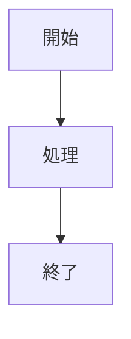

**$1** フェーズに **$2** テンプレートを新規追加します。

## 実行手順

### 1. フェーズの確認

**利用可能なフェーズ**:
- `01_planning`: 計画フェーズ
- `02_design`: 設計フェーズ
- `03_development`: 開発フェーズ
- `04_testing`: テストフェーズ
- `05_operation`: 運用フェーズ
- `06_common`: 共通ドキュメント

### 2. テンプレートベースの読み込み

`templates/06_common/template_base.md` をベースにします。

### 3. テンプレートの作成

以下の構造でテンプレートを作成：

```markdown
# [テンプレート名]

## ドキュメント情報

- **作成日**: YYYY-MM-DD
- **最終更新日**: YYYY-MM-DD
- **バージョン**: 1.0.0
- **作成者**: [あなたの名前]
- **プロジェクト**: [プロジェクト名]
- **ステータス**: Draft

## 目次

- [1. 概要](#1-概要)
- [2. メインセクション](#2-メインセクション)
- [変更履歴](#変更履歴)
- [関連ドキュメント](#関連ドキュメント)

## 1. 概要

### 1.1 目的

このドキュメントの目的を記述

### 1.2 対象読者

誰がこのドキュメントを読むか

### 1.3 前提条件

必要な前提知識や条件

## 2. メインセクション

[テンプレートの主要な内容]

### 2.1 サブセクション

詳細な内容

## 変更履歴

| バージョン | 日付 | 変更者 | 変更内容 |
|-----------|------|--------|----------|
| 1.0.0     | YYYY-MM-DD | [あなたの名前] | 初版作成 |

## 関連ドキュメント

- [関連ドキュメント1](./related_doc.md)
```

### 4. 内容のカスタマイズ

テンプレートの目的に応じて以下を追加：

#### コード例
```typescript
// 実践的なコード例を追加
```

#### Mermaid図


#### 表
| 項目 | 説明 | 例 |
|------|------|-----|
| 項目1 | 説明1 | 例1 |

### 5. ファイルの保存

以下のパスに保存：
```
templates/$1/$2.md
```

例:
- `templates/01_planning/risk_management.md`
- `templates/02_design/infrastructure_design.md`

### 6. README更新

該当フェーズの `README.md` に新しいテンプレートを追加：

```markdown
## テンプレート一覧

- [テンプレート1](./template1.md) - 説明1
- [$2](./$2.md) - 新しいテンプレートの説明  # 追加
```

### 7. 確認事項

作成後、以下を確認：
- [ ] ドキュメント情報セクションが完全
- [ ] 目次が含まれている
- [ ] 見出し階層が正しい（H1は1回のみ）
- [ ] コードブロックに言語指定がある
- [ ] Mermaid図が適切に使用されている
- [ ] プレースホルダーが一貫している
- [ ] 変更履歴セクションがある
- [ ] 関連ドキュメントへのリンクがある
- [ ] 小規模プロジェクト向けに最適化されている

### 8. 完了メッセージ

```
✅ 新しいテンプレートを作成しました！

📄 ファイル: templates/$1/$2.md
📋 フェーズ: $1
📝 テンプレート名: $2

次のステップ:
1. 内容を充実させる
2. フェーズのREADMEに追加
3. メインREADMEのテンプレート一覧を更新
4. コミット＆プッシュ
```

## 使用例

### 例1: リスク管理計画書の追加
```
/add-template 01_planning risk_management
```

### 例2: インフラ設計書の追加
```
/add-template 02_design infrastructure_design
```

## 注意事項

- 既存のテンプレートと重複しないか確認
- 小規模プロジェクト向けに最適化
- 実践的なコード例を含める
- 日本語で記述
