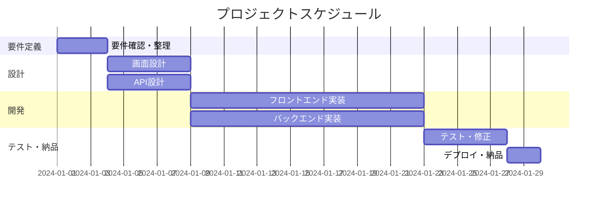

# プロジェクト概要書

## ドキュメント情報

- **作成日**: YYYY-MM-DD
- **最終更新日**: YYYY-MM-DD
- **バージョン**: 1.0.0
- **作成者**: [あなたの名前]
- **クライアント**: [クライアント名/会社名]
- **ステータス**: Draft

## 目次

- [1. 概要](#1-概要)
- [2. プロジェクトの背景と目的](#2-プロジェクトの背景と目的)
- [3. プロジェクトスコープ](#3-プロジェクトスコープ)
- [4. スケジュールとマイルストーン](#4-スケジュールとマイルストーン)
- [5. 見積もりと費用](#5-見積もりと費用)
- [6. リスクと制約事項](#6-リスクと制約事項)
- [7. 納品物と完了条件](#7-納品物と完了条件)
- [変更履歴](#変更履歴)
- [関連ドキュメント](#関連ドキュメント)

## 1. 概要

### 1.1 目的

このドキュメントは、クライアントとの合意事項を明確にし、プロジェクトの全体像を共有するためのものです。

### 1.2 プロジェクト名

[プロジェクト名]

### 1.3 概要説明

[プロジェクトの概要を2-3行で簡潔に記述]

## 2. プロジェクトの背景と目的

### 2.1 背景

[クライアントがこのプロジェクトを必要とした背景や課題]

### 2.2 解決したい課題

- [課題1]
- [課題2]
- [課題3]

### 2.3 目的

[このプロジェクトで達成したいこと]

### 2.4 期待される効果

- [効果1]
- [効果2]

## 3. プロジェクトスコープ

### 3.1 実施する内容 (In Scope)

[プロジェクトで実施する機能や作業を箇条書きで記述]

- [機能1]: [説明]
- [機能2]: [説明]
- [機能3]: [説明]

### 3.2 実施しない内容 (Out of Scope)

[誤解を避けるため、明示的に対象外とする内容を記述]

- [対象外項目1]
- [対象外項目2]

### 3.3 技術スタック

| 分類 | 技術/ツール | 備考 |
|------|-----------|------|
| フロントエンド | [例: React, Vue.js] | [バージョンなど] |
| バックエンド | [例: Node.js, Python] | [バージョンなど] |
| データベース | [例: PostgreSQL, MongoDB] | [バージョンなど] |
| インフラ | [例: AWS, Vercel] | [詳細] |
| その他 | [例: GitHub, Docker] | [詳細] |

## 4. スケジュールとマイルストーン

### 4.1 プロジェクト期間

- **開始日**: YYYY-MM-DD
- **納品予定日**: YYYY-MM-DD
- **総開発期間**: [X]週間 / [Y]ヶ月

### 4.2 スケジュール

### 4.3 主要マイルストーン

| マイルストーン | 予定日 | 内容 |
|---------------|--------|------|
| 要件確定 | YYYY-MM-DD | 仕様の最終確認 |
| 設計完了 | YYYY-MM-DD | 画面・API設計レビュー |
| 開発完了 | YYYY-MM-DD | 機能実装完了 |
| 納品 | YYYY-MM-DD | 本番環境デプロイ |

## 5. 見積もりと費用

### 5.1 開発費用

| 項目 | 工数 | 単価 | 金額 | 備考 |
|------|------|------|------|------|
| 要件定義・設計 | [X]時間 | ¥[単価]/h | ¥[金額] | - |
| フロントエンド開発 | [X]時間 | ¥[単価]/h | ¥[金額] | - |
| バックエンド開発 | [X]時間 | ¥[単価]/h | ¥[金額] | - |
| テスト・修正 | [X]時間 | ¥[単価]/h | ¥[金額] | - |
| **小計** | **[X]時間** | - | **¥[金額]** | - |

### 5.2 インフラ・その他費用 (月額)

| 項目 | 金額 | 備考 |
|------|------|------|
| サーバー・ホスティング | ¥[金額]/月 | [サービス名] |
| ドメイン | ¥[金額]/年 | - |
| 外部API利用料 | ¥[金額]/月 | [API名] |
| **合計** | **¥[金額]/月** | クライアント負担 |

### 5.3 支払い条件

- **着手金**: [割合]% (¥[金額]) - 契約時
- **中間金**: [割合]% (¥[金額]) - [マイルストーン]完了時
- **残金**: [割合]% (¥[金額]) - 納品完了時

または

- **一括払い**: ¥[金額] - 納品完了時

## 6. リスクと制約事項

### 6.1 想定されるリスク

| リスク | 影響 | 対策 |
|--------|------|------|
| [例: 要件の追加変更] | スケジュール遅延 | 変更管理プロセスを設定 |
| [例: 外部APIの仕様変更] | 実装の手戻り | 早期に動作確認 |
| [リスク3] | [影響] | [対策] |

### 6.2 制約事項

**スケジュール**:
- [例: 納期は厳守(イベント開催日が決まっている等)]

**技術**:
- [例: 既存システムとの連携が必要]
- [例: 特定のブラウザ/デバイス対応必須]

**予算**:
- [例: 予算上限は¥XXX万円]

### 6.3 前提条件

- [例: クライアント側でデザインデータを提供]
- [例: 本番環境のAWSアカウントはクライアント側で準備]
- [例: コンテンツ(テキスト・画像)はクライアント側で用意]

## 7. 納品物と完了条件

### 7.1 納品物

- [ ] ソースコード(GitHubリポジトリ)
- [ ] 本番環境へのデプロイ
- [ ] 管理者マニュアル
- [ ] API仕様書
- [ ] [その他の成果物]

### 7.2 納品方法

- **ソースコード**: GitHubプライベートリポジトリへの招待
- **本番環境**: [URL] にデプロイ
- **ドキュメント**: [Notion/Google Docs等] で共有

### 7.3 完了条件

- [ ] すべての必須機能が実装され、動作確認済み
- [ ] クライアントによる受け入れテスト完了
- [ ] 本番環境へのデプロイ完了
- [ ] ドキュメント類の納品完了
- [ ] クライアントからの最終承認取得

### 7.4 保守・サポート

**保証期間**: 納品後[X]ヶ月間

- バグ修正: [条件]
- 軽微な修正: [条件]
- 機能追加: 別途見積もり

**サポート範囲**:
- [例: 平日10:00-18:00、メール・Slack対応]
- [例: 緊急時は電話対応可能]

## 変更履歴

| バージョン | 日付 | 変更者 | 変更内容 |
|-----------|------|--------|----------|
| 1.0.0     | YYYY-MM-DD | [あなたの名前] | 初版作成 |

## 関連ドキュメント

- [要件定義書](./requirements_specification.md)
- [画面設計書](../02_design/screen_design.md)
- [API仕様書](../02_design/api_specification.md)
