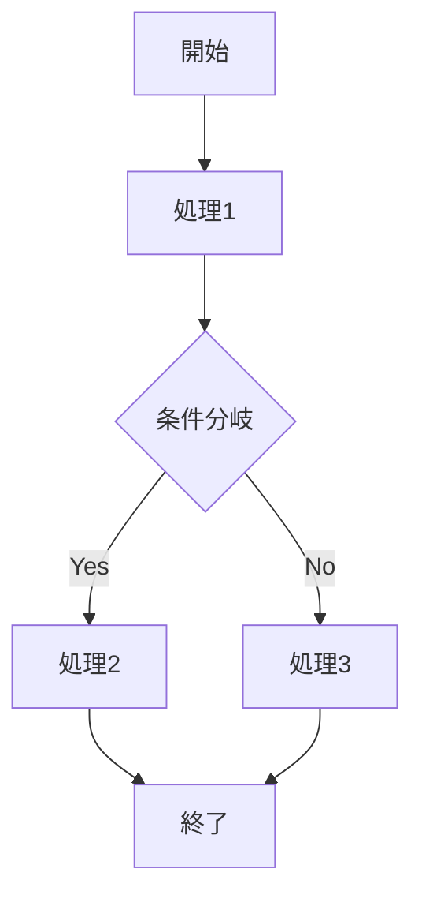
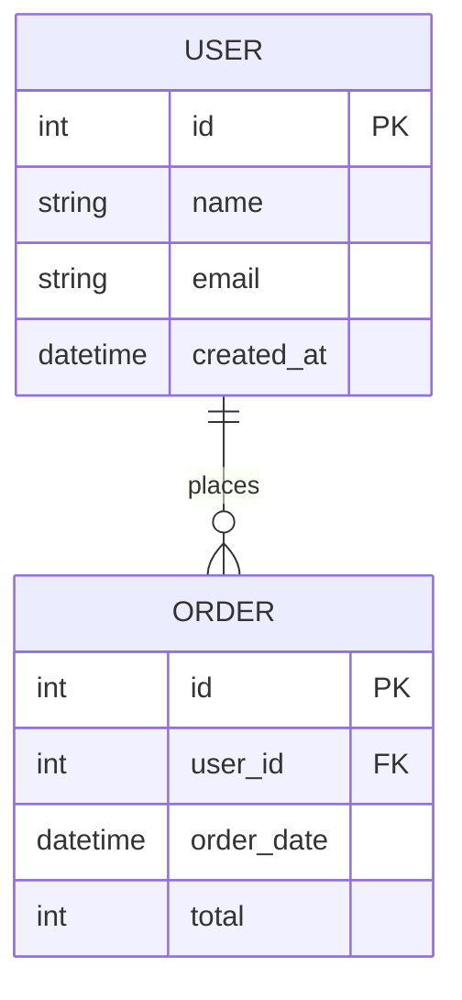
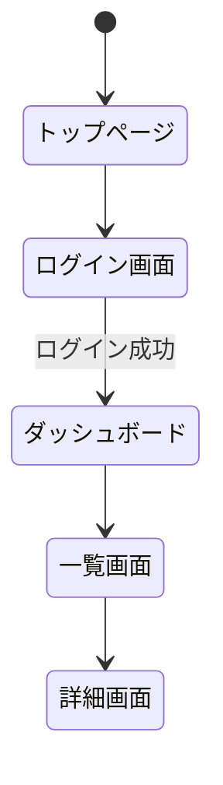

# 要件定義書

## ドキュメント情報

- **作成日**: YYYY-MM-DD
- **最終更新日**: YYYY-MM-DD
- **バージョン**: 1.0.0
- **作成者**: [あなたの名前]
- **クライアント**: [クライアント名]
- **ステータス**: Draft

## 目次

- [1. 概要](#1-概要)
- [2. 機能要件](#2-機能要件)
- [3. 非機能要件](#3-非機能要件)
- [4. データ要件](#4-データ要件)
- [5. 画面・UI要件](#5-画面ui要件)
- [6. 外部連携](#6-外部連携)
- [変更履歴](#変更履歴)
- [関連ドキュメント](#関連ドキュメント)

## 1. 概要

### 1.1 システム名

[システム/サービス名]

### 1.2 目的

[このシステムを作る目的を簡潔に記述]

### 1.3 対象ユーザー

- [ユーザー種別1]: [説明]
- [ユーザー種別2]: [説明]

### 1.4 用語定義

| 用語 | 定義 |
|------|------|
| [用語1] | [定義1] |
| [用語2] | [定義2] |

## 2. 機能要件

### 2.1 機能一覧

| 機能ID | 機能名 | 説明 | 優先度 |
|--------|--------|------|--------|
| F-01 | [機能名] | [簡単な説明] | 必須 |
| F-02 | [機能名] | [簡単な説明] | 必須 |
| F-03 | [機能名] | [簡単な説明] | 任意 |

### 2.2 機能詳細

#### F-01: [機能名]

**概要**:
[この機能が何をするのか簡潔に説明]

**詳細**:
[機能の詳細な動作を記述]

**フロー**:

**入力・出力**:
- 入力: [何を入力するか]
- 出力: [何が出力されるか]

**バリデーション**:
- [検証ルール1]
- [検証ルール2]

**完了条件**:
- [ ] [条件1]
- [ ] [条件2]

---

#### F-02: [機能名]

[F-01と同様の形式で記述]

## 3. 非機能要件

### 3.1 パフォーマンス

- ページ読み込み時間: [X]秒以内
- API応答時間: [X]ms以内
- 想定同時アクセス数: [X]人程度

### 3.2 セキュリティ

- [ ] ユーザー認証: [方式を記述]
- [ ] データ暗号化: [対象データと方式]
- [ ] XSS/CSRF対策: 実施
- [ ] 入力バリデーション: すべての入力に対して実施

### 3.3 ブラウザ・デバイス対応

**対応ブラウザ**:
- Chrome (最新版)
- Firefox (最新版)
- Safari (最新版)
- Edge (最新版)

**対応デバイス**:
- [ ] PC (デスクトップ)
- [ ] タブレット
- [ ] スマートフォン

### 3.4 可用性・保守性

- 稼働時間: [99.9%等の目標、または「ベストエフォート」]
- バックアップ: [日次/週次等]
- エラーログ: [どこに記録するか]

## 4. データ要件

### 4.1 データモデル

### 4.2 主要データ項目

#### [テーブル/コレクション名1]

| 項目名 | 型 | 必須 | 説明 |
|--------|----|----|------|
| id | int/UUID | ○ | 主キー |
| [項目名] | [型] | ○/- | [説明] |
| created_at | datetime | ○ | 作成日時 |
| updated_at | datetime | ○ | 更新日時 |

#### [テーブル/コレクション名2]

[同様に記述]

### 4.3 データ保持・バックアップ

- データ保持期間: [期間、または「無期限」]
- バックアップ頻度: [日次/週次]
- データ削除ルール: [あれば記述]

## 5. 画面・UI要件

### 5.1 画面一覧

| 画面ID | 画面名 | URL | 主な機能 |
|--------|--------|-----|----------|
| P-01 | トップページ | / | [説明] |
| P-02 | ログイン画面 | /login | ユーザー認証 |
| P-03 | [画面名] | [パス] | [説明] |

### 5.2 画面遷移

### 5.3 デザイン要件

- デザインシステム: [使用するUIライブラリやデザインシステム]
- カラー: [メインカラー、アクセントカラー等]
- フォント: [使用フォント]
- レスポンシブ: [対応するブレークポイント]

### 5.4 アクセシビリティ

- [ ] キーボード操作対応
- [ ] フォーカス表示
- [ ] 適切なコントラスト比
- [ ] alt属性の設定

## 6. 外部連携

### 6.1 外部API

| API名 | 用途 | プラン | 費用 |
|-------|------|------|------|
| [API名] | [用途] | [フリー/有料プラン名] | ¥[金額]/月 |

### 6.2 外部サービス

| サービス名 | 用途 | 備考 |
|-----------|------|------|
| [サービス名] | [認証/決済/メール送信等] | [詳細] |

## 変更履歴

| バージョン | 日付 | 変更者 | 変更内容 |
|-----------|------|--------|----------|
| 1.0.0     | YYYY-MM-DD | [あなたの名前] | 初版作成 |

## 関連ドキュメント

- [プロジェクト概要書](./project_overview.md)
- [画面設計書](../02_design/screen_design.md)
- [API仕様書](../02_design/api_specification.md)
