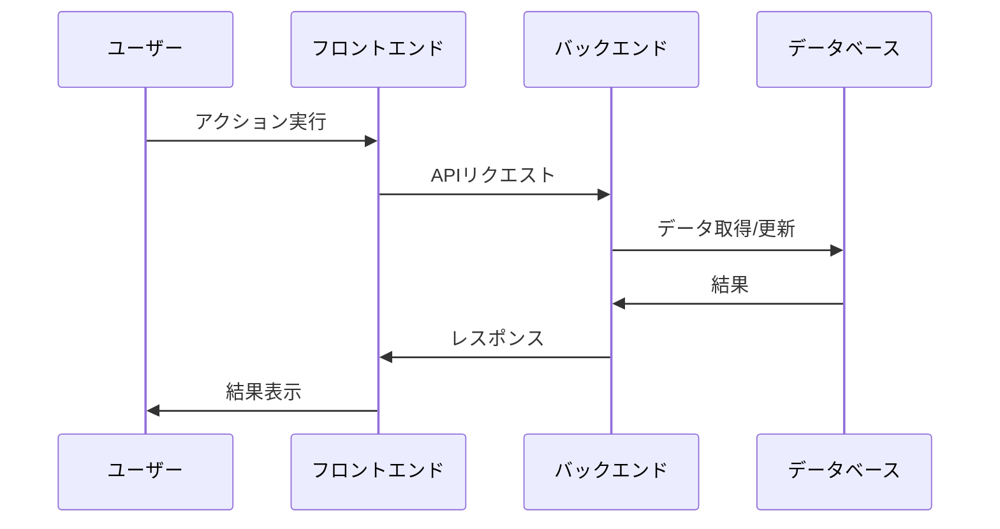
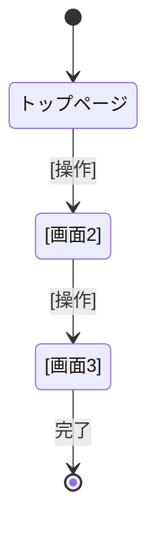

# ユースケース定義書

## ドキュメント情報

- **作成日**: YYYY-MM-DD
- **最終更新日**: YYYY-MM-DD
- **バージョン**: 1.0.0
- **作成者**: [あなたの名前]
- **クライアント**: [クライアント名]
- **ステータス**: Draft

## 目次

- [1. 概要](#1-概要)
- [2. ユーザー種別](#2-ユーザー種別)
- [3. ユースケース一覧](#3-ユースケース一覧)
- [4. ユースケース詳細](#4-ユースケース詳細)
- [5. 画面遷移](#5-画面遷移)
- [6. 画面ワイヤーフレーム](#6-画面ワイヤーフレーム)
- [変更履歴](#変更履歴)
- [関連ドキュメント](#関連ドキュメント)

## 1. 概要

### 1.1 目的

このドキュメントは、ユーザーがシステムをどのように使用するかを具体的に記述し、クライアントと開発者の認識を合わせるためのものです。

### 1.2 システム名

[システム/サービス名]

## 2. ユーザー種別

### 2.1 ユーザー一覧

| ユーザー種別 | 説明 | できること |
|------------|------|-----------|
| ゲストユーザー | 未ログインの訪問者 | [閲覧のみ、など] |
| 一般ユーザー | 登録済みユーザー | [主な操作] |
| 管理者 | システム管理者 | [すべての操作] |

### 2.2 ペルソナ (必要に応じて)

**一般ユーザー像**:
- 年齢層: [X]代
- ITスキル: [高/中/低]
- 利用シーン: [どんな時に使うか]
- 主な目的: [何をしたいか]

## 3. ユースケース一覧

| ID | ユースケース名 | ユーザー種別 | 優先度 | 説明 |
|----|--------------|------------|--------|------|
| UC-01 | [ユースケース名] | [ユーザー種別] | 必須 | [簡単な説明] |
| UC-02 | [ユースケース名] | [ユーザー種別] | 必須 | [簡単な説明] |
| UC-03 | [ユースケース名] | [ユーザー種別] | 任意 | [簡単な説明] |

## 4. ユースケース詳細

### UC-01: [ユースケース名]

**ユーザー**: [ユーザー種別]

**目的**: [ユーザーが何を達成したいか]

**事前条件**: [このユースケースを開始する前に満たすべき条件]

**基本フロー**:
1. [ステップ1]
2. [ステップ2]
3. [ステップ3]
4. [ステップ4]

**代替フロー** (エラー時など):
- [代替パターン1]: [説明]
- [代替パターン2]: [説明]

**事後条件**: [このユースケース完了後の状態]

**シーケンス図** (複雑な場合のみ):


**画面要素**:
- [ ] [必要な入力フィールド1]
- [ ] [必要な入力フィールド2]
- [ ] [ボタン]
- [ ] [表示情報]

---

### UC-02: [ユースケース名]

[UC-01と同様の形式で記述]

## 5. 画面遷移

### 5.1 画面遷移図



### 5.2 URL設計

| 画面 | URL | 説明 |
|------|-----|------|
| トップ | / | トップページ |
| [画面名] | /[path] | [説明] |

## 6. 画面ワイヤーフレーム

### 6.1 [画面名1]

**URL**: /[path]

**概要**: [この画面の目的]

**レイアウト**:
```
+----------------------------------+
|        ヘッダー/ナビ              |
+----------------------------------+
|                                  |
|  [メインコンテンツエリア]         |
|                                  |
|  [要素1]                         |
|  [要素2]                         |
|  [ボタン]                        |
|                                  |
+----------------------------------+
|        フッター                   |
+----------------------------------+
```

**主要要素**:
- [要素1]: [説明]
- [要素2]: [説明]
- [ボタン]: [動作説明]

**表示データ**:
- [データ項目1]
- [データ項目2]

---

### 6.2 [画面名2]

[6.1と同様の形式で記述]

## 変更履歴

| バージョン | 日付 | 変更者 | 変更内容 |
|-----------|------|--------|----------|
| 1.0.0     | YYYY-MM-DD | [あなたの名前] | 初版作成 |

## 関連ドキュメント

- [プロジェクト概要書](./project_overview.md)
- [要件定義書](./requirements_specification.md)
- [画面設計書](../02_design/screen_design.md)
