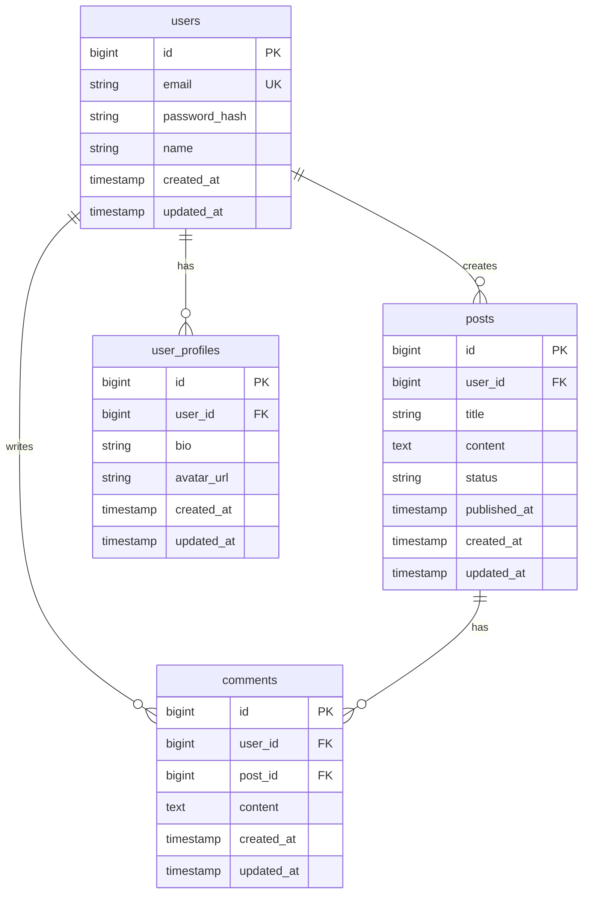

# データベース設計書

## ドキュメント情報

- **作成日**: YYYY-MM-DD
- **最終更新日**: YYYY-MM-DD
- **バージョン**: 1.0.0
- **作成者**: [あなたの名前]
- **クライアント**: [クライアント名]
- **ステータス**: Draft

## 目次

- [1. 概要](#1-概要)
- [2. ER図](#2-er図)
- [3. テーブル定義](#3-テーブル定義)
- [4. インデックス設計](#4-インデックス設計)
- [5. マイグレーション](#5-マイグレーション)
- [変更履歴](#変更履歴)
- [関連ドキュメント](#関連ドキュメント)

## 1. 概要

### 1.1 データベース情報

- **DBMS**: [PostgreSQL/MySQL/MongoDB]
- **バージョン**: [X.X.X]
- **文字コード**: UTF-8
- **タイムゾーン**: Asia/Tokyo (UTC+9)

### 1.2 命名規則

- **テーブル名**: 複数形、スネークケース (例: `users`, `order_items`)
- **カラム名**: スネークケース (例: `user_id`, `created_at`)
- **主キー**: `id` (自動採番)
- **外部キー**: `{参照テーブル名}_id` (例: `user_id`)
- **タイムスタンプ**: `created_at`, `updated_at`

## 2. ER図

### 2.1 全体ER図



### 2.2 主要なリレーション

| 親テーブル | 子テーブル | 関係 | 説明 |
|----------|----------|------|------|
| users | user_profiles | 1:1 | ユーザーとプロフィール |
| users | posts | 1:N | ユーザーと投稿 |
| users | comments | 1:N | ユーザーとコメント |
| posts | comments | 1:N | 投稿とコメント |

## 3. テーブル定義

### 3.1 users (ユーザー)

**説明**: システムの利用ユーザー情報

| カラム名 | 型 | NULL | デフォルト | 説明 |
|---------|----|----|----------|------|
| id | BIGINT | NO | AUTO_INCREMENT | 主キー |
| email | VARCHAR(255) | NO | - | メールアドレス（ログインID） |
| password_hash | VARCHAR(255) | NO | - | パスワードハッシュ |
| name | VARCHAR(100) | NO | - | ユーザー名 |
| role | VARCHAR(20) | NO | 'user' | ロール (user/admin) |
| email_verified_at | TIMESTAMP | YES | NULL | メール確認日時 |
| created_at | TIMESTAMP | NO | CURRENT_TIMESTAMP | 作成日時 |
| updated_at | TIMESTAMP | NO | CURRENT_TIMESTAMP | 更新日時 |

**制約**:
- PRIMARY KEY: `id`
- UNIQUE KEY: `email`
- INDEX: `role`, `created_at`

**備考**:
- パスワードはbcryptでハッシュ化して保存
- メールアドレスは小文字に正規化して保存

---

### 3.2 user_profiles (ユーザープロフィール)

**説明**: ユーザーの詳細プロフィール情報

| カラム名 | 型 | NULL | デフォルト | 説明 |
|---------|----|----|----------|------|
| id | BIGINT | NO | AUTO_INCREMENT | 主キー |
| user_id | BIGINT | NO | - | ユーザーID (外部キー) |
| bio | TEXT | YES | NULL | 自己紹介 |
| avatar_url | VARCHAR(500) | YES | NULL | アバター画像URL |
| website | VARCHAR(255) | YES | NULL | ウェブサイト |
| location | VARCHAR(100) | YES | NULL | 所在地 |
| created_at | TIMESTAMP | NO | CURRENT_TIMESTAMP | 作成日時 |
| updated_at | TIMESTAMP | NO | CURRENT_TIMESTAMP | 更新日時 |

**制約**:
- PRIMARY KEY: `id`
- UNIQUE KEY: `user_id`
- FOREIGN KEY: `user_id` REFERENCES `users(id)` ON DELETE CASCADE

---

### 3.3 posts (投稿)

**説明**: ユーザーの投稿データ

| カラム名 | 型 | NULL | デフォルト | 説明 |
|---------|----|----|----------|------|
| id | BIGINT | NO | AUTO_INCREMENT | 主キー |
| user_id | BIGINT | NO | - | 投稿者ID (外部キー) |
| title | VARCHAR(200) | NO | - | タイトル |
| slug | VARCHAR(255) | NO | - | URLスラッグ |
| content | TEXT | NO | - | 本文 |
| status | VARCHAR(20) | NO | 'draft' | ステータス (draft/published) |
| published_at | TIMESTAMP | YES | NULL | 公開日時 |
| created_at | TIMESTAMP | NO | CURRENT_TIMESTAMP | 作成日時 |
| updated_at | TIMESTAMP | NO | CURRENT_TIMESTAMP | 更新日時 |

**制約**:
- PRIMARY KEY: `id`
- UNIQUE KEY: `slug`
- FOREIGN KEY: `user_id` REFERENCES `users(id)` ON DELETE CASCADE
- INDEX: `status`, `published_at`, `created_at`

**備考**:
- slugはタイトルから自動生成し、URLで使用
- statusが'published'の場合のみ公開される

---

### 3.4 comments (コメント)

**説明**: 投稿に対するコメント

| カラム名 | 型 | NULL | デフォルト | 説明 |
|---------|----|----|----------|------|
| id | BIGINT | NO | AUTO_INCREMENT | 主キー |
| user_id | BIGINT | NO | - | コメント投稿者ID (外部キー) |
| post_id | BIGINT | NO | - | 投稿ID (外部キー) |
| content | TEXT | NO | - | コメント内容 |
| created_at | TIMESTAMP | NO | CURRENT_TIMESTAMP | 作成日時 |
| updated_at | TIMESTAMP | NO | CURRENT_TIMESTAMP | 更新日時 |

**制約**:
- PRIMARY KEY: `id`
- FOREIGN KEY: `user_id` REFERENCES `users(id)` ON DELETE CASCADE
- FOREIGN KEY: `post_id` REFERENCES `posts(id)` ON DELETE CASCADE
- INDEX: `post_id`, `created_at`

---

### 3.5 [その他のテーブル]

[必要に応じて追加]

## 4. インデックス設計

### 4.1 インデックス一覧

| テーブル | カラム | 種類 | 目的 |
|---------|-------|------|------|
| users | email | UNIQUE | ログイン時の検索 |
| users | role | INDEX | ロール別ユーザー一覧 |
| posts | user_id | INDEX | ユーザーの投稿一覧 |
| posts | slug | UNIQUE | URL検索 |
| posts | status, published_at | INDEX | 公開投稿の検索・ソート |
| comments | post_id | INDEX | 投稿のコメント一覧 |
| comments | user_id | INDEX | ユーザーのコメント一覧 |

### 4.2 複合インデックス

```sql
-- 公開済み投稿を日付順で取得する際に使用
CREATE INDEX idx_posts_status_published_at
ON posts(status, published_at DESC);

-- ユーザーの投稿を日付順で取得する際に使用
CREATE INDEX idx_posts_user_created
ON posts(user_id, created_at DESC);
```

## 5. マイグレーション

### 5.1 マイグレーション戦略

- ツール: [Prisma Migrate/TypeORM/Alembic]
- すべてのスキーマ変更はマイグレーションファイルで管理
- ロールバック可能な設計

### 5.2 初期マイグレーション

**001_create_users_table.sql**:
```sql
CREATE TABLE users (
    id BIGSERIAL PRIMARY KEY,
    email VARCHAR(255) NOT NULL UNIQUE,
    password_hash VARCHAR(255) NOT NULL,
    name VARCHAR(100) NOT NULL,
    role VARCHAR(20) NOT NULL DEFAULT 'user',
    email_verified_at TIMESTAMP,
    created_at TIMESTAMP NOT NULL DEFAULT CURRENT_TIMESTAMP,
    updated_at TIMESTAMP NOT NULL DEFAULT CURRENT_TIMESTAMP
);

CREATE INDEX idx_users_role ON users(role);
CREATE INDEX idx_users_created_at ON users(created_at);
```

**002_create_user_profiles_table.sql**:
```sql
CREATE TABLE user_profiles (
    id BIGSERIAL PRIMARY KEY,
    user_id BIGINT NOT NULL UNIQUE,
    bio TEXT,
    avatar_url VARCHAR(500),
    website VARCHAR(255),
    location VARCHAR(100),
    created_at TIMESTAMP NOT NULL DEFAULT CURRENT_TIMESTAMP,
    updated_at TIMESTAMP NOT NULL DEFAULT CURRENT_TIMESTAMP,
    FOREIGN KEY (user_id) REFERENCES users(id) ON DELETE CASCADE
);
```

**003_create_posts_table.sql**:
```sql
CREATE TABLE posts (
    id BIGSERIAL PRIMARY KEY,
    user_id BIGINT NOT NULL,
    title VARCHAR(200) NOT NULL,
    slug VARCHAR(255) NOT NULL UNIQUE,
    content TEXT NOT NULL,
    status VARCHAR(20) NOT NULL DEFAULT 'draft',
    published_at TIMESTAMP,
    created_at TIMESTAMP NOT NULL DEFAULT CURRENT_TIMESTAMP,
    updated_at TIMESTAMP NOT NULL DEFAULT CURRENT_TIMESTAMP,
    FOREIGN KEY (user_id) REFERENCES users(id) ON DELETE CASCADE
);

CREATE INDEX idx_posts_user_id ON posts(user_id);
CREATE INDEX idx_posts_status ON posts(status);
CREATE INDEX idx_posts_published_at ON posts(published_at DESC);
CREATE INDEX idx_posts_status_published_at ON posts(status, published_at DESC);
```

**004_create_comments_table.sql**:
```sql
CREATE TABLE comments (
    id BIGSERIAL PRIMARY KEY,
    user_id BIGINT NOT NULL,
    post_id BIGINT NOT NULL,
    content TEXT NOT NULL,
    created_at TIMESTAMP NOT NULL DEFAULT CURRENT_TIMESTAMP,
    updated_at TIMESTAMP NOT NULL DEFAULT CURRENT_TIMESTAMP,
    FOREIGN KEY (user_id) REFERENCES users(id) ON DELETE CASCADE,
    FOREIGN KEY (post_id) REFERENCES posts(id) ON DELETE CASCADE
);

CREATE INDEX idx_comments_post_id ON comments(post_id);
CREATE INDEX idx_comments_user_id ON comments(user_id);
CREATE INDEX idx_comments_created_at ON comments(created_at);
```

### 5.3 マイグレーション実行手順

**開発環境**:
```bash
# マイグレーション実行
npm run db:migrate

# ロールバック
npm run db:rollback

# シードデータ投入
npm run db:seed
```

**本番環境**:
```bash
# 事前にバックアップを取得
pg_dump dbname > backup.sql

# マイグレーション実行
npm run db:migrate:prod
```

### 5.4 シードデータ

**開発用テストデータ**:
```sql
-- テストユーザー作成
INSERT INTO users (email, password_hash, name, role) VALUES
('admin@example.com', '$2b$10$...', 'Admin User', 'admin'),
('user@example.com', '$2b$10$...', 'Test User', 'user');
```

## 変更履歴

| バージョン | 日付 | 変更者 | 変更内容 |
|-----------|------|--------|----------|
| 1.0.0     | YYYY-MM-DD | [あなたの名前] | 初版作成 |

## 関連ドキュメント

- [要件定義書](../01_planning/requirements_specification.md)
- [システム設計書](./system_design.md)
- [API仕様書](./api_specification.md)
