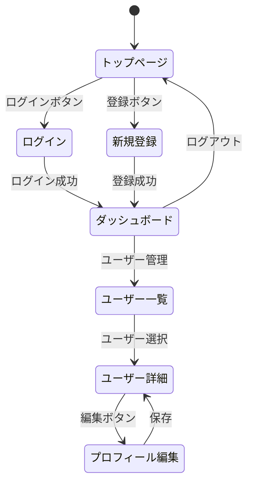
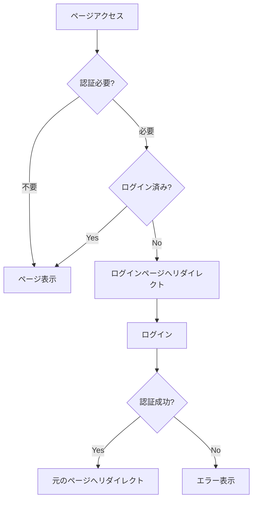

# 画面設計書

## ドキュメント情報

- **作成日**: YYYY-MM-DD
- **最終更新日**: YYYY-MM-DD
- **バージョン**: 1.0.0
- **作成者**: [あなたの名前]
- **クライアント**: [クライアント名]
- **ステータス**: Draft

## 目次

- [1. 概要](#1-概要)
- [2. デザインシステム](#2-デザインシステム)
- [3. 画面一覧](#3-画面一覧)
- [4. 画面遷移](#4-画面遷移)
- [5. 画面詳細](#5-画面詳細)
- [6. コンポーネント設計](#6-コンポーネント設計)
- [変更履歴](#変更履歴)
- [関連ドキュメント](#関連ドキュメント)

## 1. 概要

### 1.1 目的

このドキュメントは、システムの画面設計を定義し、開発の指針とするためのものです。

### 1.2 対象デバイス

- [ ] デスクトップ (1920x1080以上)
- [ ] タブレット (768x1024)
- [ ] スマートフォン (375x667以上)

### 1.3 対応ブラウザ

- Chrome (最新版)
- Firefox (最新版)
- Safari (最新版)
- Edge (最新版)

## 2. デザインシステム

### 2.1 カラーパレット

**プライマリーカラー**:
- Primary: `#3B82F6` (Blue)
- Primary Dark: `#2563EB`
- Primary Light: `#93C5FD`

**セカンダリーカラー**:
- Secondary: `#8B5CF6` (Purple)
- Secondary Dark: `#7C3AED`
- Secondary Light: `#C4B5FD`

**ニュートラルカラー**:
- Black: `#000000`
- Gray-900: `#111827`
- Gray-700: `#374151`
- Gray-500: `#6B7280`
- Gray-300: `#D1D5DB`
- Gray-100: `#F3F4F6`
- White: `#FFFFFF`

**セマンティックカラー**:
- Success: `#10B981` (Green)
- Warning: `#F59E0B` (Orange)
- Error: `#EF4444` (Red)
- Info: `#3B82F6` (Blue)

### 2.2 タイポグラフィ

**フォントファミリー**:
```css
font-family: 'Inter', -apple-system, BlinkMacSystemFont, 'Segoe UI', sans-serif;
```

**フォントサイズ**:
| サイズ | 値 | 用途 |
|-------|-----|------|
| xs | 12px | キャプション |
| sm | 14px | 小テキスト |
| base | 16px | 本文 |
| lg | 18px | リード文 |
| xl | 20px | 小見出し |
| 2xl | 24px | 見出し3 |
| 3xl | 30px | 見出し2 |
| 4xl | 36px | 見出し1 |

**フォントウェイト**:
- Regular: 400
- Medium: 500
- Semibold: 600
- Bold: 700

### 2.3 スペーシング

| サイズ | 値 | 用途 |
|-------|-----|------|
| xs | 4px | 極小 |
| sm | 8px | 小 |
| md | 16px | 中 |
| lg | 24px | 大 |
| xl | 32px | 特大 |
| 2xl | 48px | セクション間 |

### 2.4 ブレークポイント

```css
/* モバイル */
@media (max-width: 639px) { }

/* タブレット */
@media (min-width: 640px) and (max-width: 1023px) { }

/* デスクトップ */
@media (min-width: 1024px) { }
```

### 2.5 レイアウト

**最大幅**:
- コンテンツ: 1200px
- テキスト: 800px

**グリッド**:
- カラム数: 12
- ガター: 16px (モバイル), 24px (デスクトップ)

## 3. 画面一覧

| 画面ID | 画面名 | URL | 認証 | 優先度 |
|--------|--------|-----|------|--------|
| P-01 | トップページ | / | 不要 | 必須 |
| P-02 | ログイン | /login | 不要 | 必須 |
| P-03 | 新規登録 | /register | 不要 | 必須 |
| P-04 | ダッシュボード | /dashboard | 必要 | 必須 |
| P-05 | ユーザー一覧 | /users | 必要 | 必須 |
| P-06 | ユーザー詳細 | /users/:id | 必要 | 必須 |
| P-07 | プロフィール編集 | /profile | 必要 | 必須 |
| P-08 | [画面名] | [パス] | [必要/不要] | [必須/任意] |

## 4. 画面遷移

### 4.1 画面遷移図



### 4.2 認証フロー



## 5. 画面詳細

### P-01: トップページ

**URL**: `/`

**概要**: サービスの紹介とログイン・登録への導線を提供

**レイアウト (デスクトップ)**:
```
+--------------------------------------------------+
|  [ロゴ]              [ログイン] [新規登録]        |
+--------------------------------------------------+
|                                                  |
|              サービス名                           |
|           キャッチコピー                          |
|                                                  |
|         [今すぐ始める] [詳しく見る]               |
|                                                  |
+--------------------------------------------------+
|                                                  |
|              主な機能                             |
|                                                  |
|   [機能1]      [機能2]      [機能3]              |
|                                                  |
+--------------------------------------------------+
|              フッター                             |
+--------------------------------------------------+
```

**主要要素**:
- ヘッダー
  - ロゴ
  - ナビゲーション (ログイン/新規登録ボタン)
- ヒーローセクション
  - サービス名 (h1)
  - キャッチコピー
  - CTA (Call To Action) ボタン
- 機能紹介セクション
  - 3カラムのカード
- フッター
  - コピーライト
  - リンク

**使用コンポーネント**:
- Header
- Hero
- FeatureCard
- Footer

**API**: なし

**状態管理**: なし

---

### P-02: ログイン

**URL**: `/login`

**概要**: ユーザー認証を行う

**レイアウト**:
```
+----------------------------------+
|          [ロゴ]                   |
+----------------------------------+
|          ログイン                 |
|                                  |
| メールアドレス                    |
| [___________________________]    |
|                                  |
| パスワード                        |
| [___________________________]    |
|                                  |
| [ ] ログイン状態を保持する         |
|                                  |
|        [ ログイン ]              |
|                                  |
| パスワードをお忘れですか?          |
|                                  |
| アカウントをお持ちでないですか?     |
| 新規登録はこちら                  |
+----------------------------------+
```

**主要要素**:
- ロゴ
- フォーム
  - メールアドレス入力 (type="email", required)
  - パスワード入力 (type="password", required)
  - 「ログイン状態を保持」チェックボックス
  - ログインボタン
- リンク
  - パスワードリセット
  - 新規登録

**バリデーション**:
| フィールド | ルール |
|----------|--------|
| email | 必須、メール形式 |
| password | 必須、8文字以上 |

**API**:
- `POST /api/auth/login`

**状態管理**:
- `isLoading`: ログイン処理中フラグ
- `error`: エラーメッセージ

**処理フロー**:
1. フォーム入力
2. クライアント側バリデーション
3. API送信
4. 認証成功 → トークン保存 → ダッシュボードへリダイレクト
5. 認証失敗 → エラーメッセージ表示

---

### P-03: 新規登録

**URL**: `/register`

**概要**: 新規ユーザーアカウントを作成する

**レイアウト**:
```
+----------------------------------+
|          [ロゴ]                   |
+----------------------------------+
|       新規ユーザー登録             |
|                                  |
| 名前                             |
| [___________________________]    |
|                                  |
| メールアドレス                    |
| [___________________________]    |
|                                  |
| パスワード                        |
| [___________________________]    |
| 8文字以上、英数字と記号を含む      |
|                                  |
| パスワード(確認)                  |
| [___________________________]    |
|                                  |
| [ ] 利用規約に同意する            |
|                                  |
|        [   登録   ]              |
|                                  |
| 既にアカウントをお持ちですか?      |
| ログインはこちら                  |
+----------------------------------+
```

**主要要素**:
- フォーム
  - 名前入力 (required)
  - メールアドレス入力 (type="email", required)
  - パスワード入力 (type="password", required)
  - パスワード確認入力 (type="password", required)
  - 利用規約同意チェックボックス (required)
  - 登録ボタン

**バリデーション**:
| フィールド | ルール |
|----------|--------|
| name | 必須、2-100文字 |
| email | 必須、メール形式、未登録 |
| password | 必須、8文字以上、英数字と記号を含む |
| password_confirmation | 必須、passwordと一致 |
| terms | 必須、チェック済み |

**API**:
- `POST /api/auth/register`

**処理フロー**:
1. フォーム入力
2. リアルタイムバリデーション表示
3. 送信時にバリデーション
4. API送信
5. 成功 → トークン保存 → ダッシュボードへ
6. 失敗 → エラー表示

---

### P-04: ダッシュボード

**URL**: `/dashboard`

**概要**: ログイン後のメイン画面

**認証**: 必要

**レイアウト**:
```
+--------------------------------------------------+
| [ロゴ]  [ナビ1] [ナビ2] [ナビ3]     [ユーザー]   |
+--------------------------------------------------+
| |                                              | |
| | サイド                                       | |
| | バー    ダッシュボード                        | |
| |                                              | |
| | [メニュー1]  統計情報                         | |
| | [メニュー2]                                  | |
| | [メニュー3]  [カード1] [カード2] [カード3]    | |
| |                                              | |
| |         最近のアクティビティ                  | |
| |                                              | |
| |         +---------------------------+        | |
| |         | アイテム1                  |        | |
| |         | アイテム2                  |        | |
| |         | アイテム3                  |        | |
| |         +---------------------------+        | |
| |                                              | |
+--------------------------------------------------+
```

**主要要素**:
- ヘッダー
  - ロゴ
  - グローバルナビゲーション
  - ユーザーメニュー (プロフィール/ログアウト)
- サイドバー
  - メインメニュー
- メインコンテンツ
  - 統計カード (3カラム)
  - アクティビティリスト

**API**:
- `GET /api/auth/me`
- `GET /api/dashboard/stats`

**状態管理**:
- `user`: 認証ユーザー情報
- `stats`: 統計データ

---

### P-05: ユーザー一覧

**URL**: `/users`

**概要**: ユーザーの一覧を表示し、検索・フィルタリング可能

**認証**: 必要

**レイアウト**:
```
+--------------------------------------------------+
| ユーザー一覧                                      |
|                                                  |
| [検索]                    [新規作成]              |
|                                                  |
| +----------------------------------------------+ |
| | ID | 名前      | メール             | 操作  | |
| |----+-----------+-------------------+-------| |
| | 1  | 山田太郎   | yamada@example.com | 詳細 | |
| | 2  | 田中花子   | tanaka@example.com | 詳細 | |
| +----------------------------------------------+ |
|                                                  |
| [前へ] 1 2 3 4 5 [次へ]                         |
+--------------------------------------------------+
```

**主要要素**:
- 検索バー
- 新規作成ボタン
- データテーブル
  - ソート機能
  - 各行にアクションボタン (詳細/編集/削除)
- ページネーション

**API**:
- `GET /api/users?page=1&limit=20&search={query}`

**状態管理**:
- `users`: ユーザーリスト
- `pagination`: ページネーション情報
- `searchQuery`: 検索クエリ
- `isLoading`: ローディング状態

---

### P-06: ユーザー詳細

**URL**: `/users/:id`

**概要**: 特定ユーザーの詳細情報を表示

**認証**: 必要

**レイアウト**:
```
+----------------------------------+
| ← 戻る                           |
|                                  |
| [アバター]    山田太郎             |
|              yamada@example.com  |
|              [編集] [削除]        |
|                                  |
+----------------------------------+
| プロフィール                      |
|                                  |
| 自己紹介: こんにちは...           |
| ウェブサイト: https://...         |
| 登録日: 2024-01-01               |
|                                  |
+----------------------------------+
| アクティビティ                    |
|                                  |
| - 投稿1                          |
| - 投稿2                          |
+----------------------------------+
```

**主要要素**:
- 戻るボタン
- ユーザー情報カード
  - アバター
  - 名前
  - メールアドレス
  - アクションボタン (編集/削除)
- プロフィール詳細
- アクティビティリスト

**API**:
- `GET /api/users/:id`

**状態管理**:
- `user`: ユーザー詳細データ

---

### P-07: プロフィール編集

**URL**: `/profile`

**概要**: 自分のプロフィールを編集する

**認証**: 必要

**レイアウト**:
```
+----------------------------------+
| プロフィール編集                  |
|                                  |
| アバター                         |
| [画像]  [画像を変更]              |
|                                  |
| 名前                             |
| [___________________________]    |
|                                  |
| メールアドレス                    |
| [___________________________]    |
|                                  |
| 自己紹介                         |
| [___________________________]    |
| [___________________________]    |
|                                  |
| ウェブサイト                      |
| [___________________________]    |
|                                  |
| [キャンセル]  [保存]              |
+----------------------------------+
```

**主要要素**:
- アバター画像アップロード
- フォーム
  - 名前
  - メールアドレス
  - 自己紹介 (textarea)
  - ウェブサイト
- 保存/キャンセルボタン

**API**:
- `GET /api/auth/me`
- `PUT /api/users/:id`
- `POST /api/upload` (画像アップロード)

**バリデーション**:
| フィールド | ルール |
|----------|--------|
| name | 必須、2-100文字 |
| email | 必須、メール形式 |
| bio | 500文字以内 |
| website | URL形式 |

**処理フロー**:
1. 現在のユーザー情報を取得して表示
2. フォーム編集
3. 保存ボタンクリック
4. バリデーション
5. API送信
6. 成功 → 完了メッセージ表示
7. 失敗 → エラー表示

## 6. コンポーネント設計

### 6.1 共通コンポーネント

| コンポーネント | 説明 | Props |
|--------------|------|-------|
| Button | ボタン | variant, size, onClick, disabled |
| Input | 入力フィールド | type, placeholder, value, onChange, error |
| Card | カード | title, children |
| Modal | モーダル | isOpen, onClose, title, children |
| Table | テーブル | columns, data, onSort |
| Pagination | ページネーション | currentPage, totalPages, onPageChange |
| Header | ヘッダー | user, onLogout |
| Sidebar | サイドバー | menuItems, activeItem |

### 6.2 コンポーネント例

**Button**:
```tsx
<Button variant="primary" size="md" onClick={handleClick}>
  ログイン
</Button>
```

Props:
- `variant`: 'primary' | 'secondary' | 'danger' | 'ghost'
- `size`: 'sm' | 'md' | 'lg'
- `onClick`: クリックハンドラー
- `disabled`: boolean

**Input**:
```tsx
<Input
  type="email"
  placeholder="メールアドレス"
  value={email}
  onChange={setEmail}
  error={errors.email}
/>
```

Props:
- `type`: input type
- `placeholder`: string
- `value`: string
- `onChange`: (value: string) => void
- `error`: string (エラーメッセージ)

## 変更履歴

| バージョン | 日付 | 変更者 | 変更内容 |
|-----------|------|--------|----------|
| 1.0.0     | YYYY-MM-DD | [あなたの名前] | 初版作成 |

## 関連ドキュメント

- [要件定義書](../01_planning/requirements_specification.md)
- [ユースケース定義書](../01_planning/use_case_document.md)
- [システム設計書](./system_design.md)
- [API仕様書](./api_specification.md)
