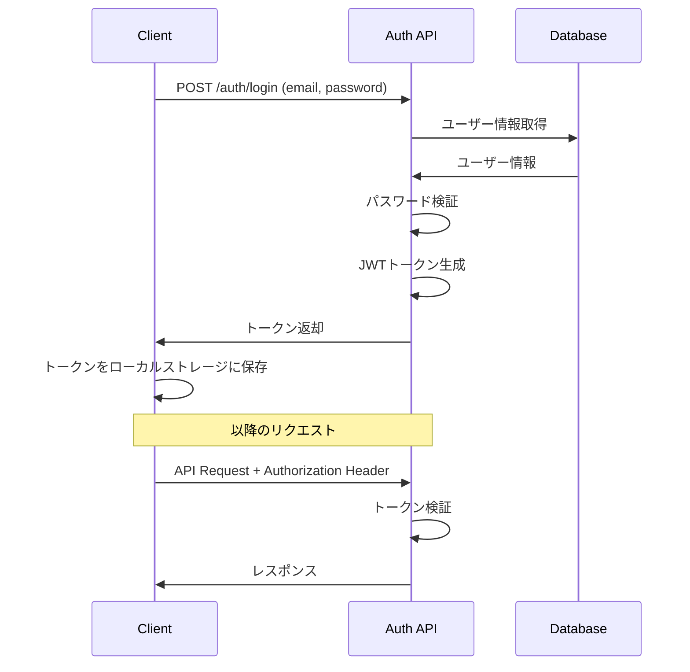

# 技術仕様書

## ドキュメント情報

- **作成日**: YYYY-MM-DD
- **最終更新日**: YYYY-MM-DD
- **バージョン**: 1.0.0
- **作成者**: [あなたの名前]
- **プロジェクト**: [プロジェクト名]
- **ステータス**: Draft

## 目次

- [1. 概要](#1-概要)
- [2. 認証・認可](#2-認証認可)
- [3. データ処理](#3-データ処理)
- [4. ファイル処理](#4-ファイル処理)
- [5. 外部API連携](#5-外部api連携)
- [6. エラーハンドリング](#6-エラーハンドリング)
- [7. ロギング](#7-ロギング)
- [8. パフォーマンス最適化](#8-パフォーマンス最適化)
- [9. セキュリティ対策](#9-セキュリティ対策)
- [変更履歴](#変更履歴)
- [関連ドキュメント](#関連ドキュメント)

## 1. 概要

### 1.1 目的

このドキュメントは、主要機能の技術的な実装詳細を記述し、開発時の指針とします。

### 1.2 対象範囲

- 認証・認可の実装方法
- データ処理のロジック
- ファイル処理
- 外部サービス連携
- エラーハンドリング戦略

## 2. 認証・認可

### 2.1 認証方式

**使用技術**: JWT (JSON Web Token)

**認証フロー**:



### 2.2 実装詳細

**トークン生成 (Node.js/TypeScript)**:
```typescript
import jwt from 'jsonwebtoken';
import bcrypt from 'bcrypt';

interface JWTPayload {
  userId: number;
  email: string;
  role: string;
}

export async function login(email: string, password: string) {
  // 1. ユーザー取得
  const user = await db.user.findUnique({
    where: { email: email.toLowerCase() }
  });

  if (!user) {
    throw new UnauthorizedError('Invalid credentials');
  }

  // 2. パスワード検証
  const isValid = await bcrypt.compare(password, user.passwordHash);
  if (!isValid) {
    throw new UnauthorizedError('Invalid credentials');
  }

  // 3. JWTトークン生成
  const payload: JWTPayload = {
    userId: user.id,
    email: user.email,
    role: user.role
  };

  const token = jwt.sign(
    payload,
    process.env.JWT_SECRET!,
    { expiresIn: '1h' }
  );

  return {
    user: {
      id: user.id,
      email: user.email,
      name: user.name,
      role: user.role
    },
    accessToken: token,
    tokenType: 'Bearer',
    expiresIn: 3600
  };
}
```

**認証ミドルウェア**:
```typescript
import { Request, Response, NextFunction } from 'express';
import jwt from 'jsonwebtoken';

export interface AuthRequest extends Request {
  user?: JWTPayload;
}

export function authenticateToken(
  req: AuthRequest,
  res: Response,
  next: NextFunction
) {
  const authHeader = req.headers['authorization'];
  const token = authHeader && authHeader.split(' ')[1]; // Bearer TOKEN

  if (!token) {
    return res.status(401).json({
      error: {
        code: 'UNAUTHORIZED',
        message: 'Authentication required'
      }
    });
  }

  try {
    const payload = jwt.verify(
      token,
      process.env.JWT_SECRET!
    ) as JWTPayload;

    req.user = payload;
    next();
  } catch (error) {
    return res.status(401).json({
      error: {
        code: 'INVALID_TOKEN',
        message: 'Invalid or expired token'
      }
    });
  }
}
```

**権限チェックミドルウェア**:
```typescript
export function requireRole(...allowedRoles: string[]) {
  return (req: AuthRequest, res: Response, next: NextFunction) => {
    if (!req.user) {
      return res.status(401).json({
        error: {
          code: 'UNAUTHORIZED',
          message: 'Authentication required'
        }
      });
    }

    if (!allowedRoles.includes(req.user.role)) {
      return res.status(403).json({
        error: {
          code: 'FORBIDDEN',
          message: 'Insufficient permissions'
        }
      });
    }

    next();
  };
}

// 使用例
router.delete('/users/:id',
  authenticateToken,
  requireRole('admin'),
  deleteUser
);
```

**フロントエンド (React)**:
```typescript
// api/client.ts
import axios from 'axios';

const apiClient = axios.create({
  baseURL: process.env.NEXT_PUBLIC_API_URL,
  headers: {
    'Content-Type': 'application/json'
  }
});

// リクエストインターセプター: トークンを自動付与
apiClient.interceptors.request.use((config) => {
  const token = localStorage.getItem('accessToken');
  if (token) {
    config.headers.Authorization = `Bearer ${token}`;
  }
  return config;
});

// レスポンスインターセプター: 401エラー時にログアウト
apiClient.interceptors.response.use(
  (response) => response,
  (error) => {
    if (error.response?.status === 401) {
      localStorage.removeItem('accessToken');
      window.location.href = '/login';
    }
    return Promise.reject(error);
  }
);

export default apiClient;
```

### 2.3 パスワードハッシュ化

```typescript
import bcrypt from 'bcrypt';

const SALT_ROUNDS = 10;

export async function hashPassword(password: string): Promise<string> {
  return bcrypt.hash(password, SALT_ROUNDS);
}

export async function verifyPassword(
  password: string,
  hash: string
): Promise<boolean> {
  return bcrypt.compare(password, hash);
}
```

## 3. データ処理

### 3.1 データバリデーション

**使用ライブラリ**: Zod

```typescript
import { z } from 'zod';

// スキーマ定義
export const createUserSchema = z.object({
  email: z.string().email('Invalid email format'),
  password: z.string()
    .min(8, 'Password must be at least 8 characters')
    .regex(/[A-Z]/, 'Password must contain uppercase letter')
    .regex(/[a-z]/, 'Password must contain lowercase letter')
    .regex(/[0-9]/, 'Password must contain number'),
  name: z.string()
    .min(2, 'Name must be at least 2 characters')
    .max(100, 'Name must be less than 100 characters')
});

export const updateUserSchema = z.object({
  name: z.string().min(2).max(100).optional(),
  bio: z.string().max(500).optional(),
  website: z.string().url().optional()
});

// バリデーションミドルウェア
export function validateBody(schema: z.ZodSchema) {
  return (req: Request, res: Response, next: NextFunction) => {
    try {
      req.body = schema.parse(req.body);
      next();
    } catch (error) {
      if (error instanceof z.ZodError) {
        return res.status(400).json({
          error: {
            code: 'VALIDATION_ERROR',
            message: 'Validation failed',
            details: error.errors.map(err => ({
              field: err.path.join('.'),
              message: err.message
            }))
          }
        });
      }
      next(error);
    }
  };
}

// 使用例
router.post('/users',
  validateBody(createUserSchema),
  createUser
);
```

### 3.2 データベース操作

**トランザクション処理**:
```typescript
// Prisma の例
export async function createUserWithProfile(data: CreateUserData) {
  return await db.$transaction(async (tx) => {
    // 1. ユーザー作成
    const user = await tx.user.create({
      data: {
        email: data.email,
        passwordHash: await hashPassword(data.password),
        name: data.name
      }
    });

    // 2. プロフィール作成
    const profile = await tx.userProfile.create({
      data: {
        userId: user.id,
        bio: data.bio || null
      }
    });

    return { user, profile };
  });
}
```

**ページネーション**:
```typescript
interface PaginationParams {
  page: number;
  limit: number;
}

export async function getPaginatedUsers(params: PaginationParams) {
  const { page, limit } = params;
  const skip = (page - 1) * limit;

  const [users, total] = await Promise.all([
    db.user.findMany({
      skip,
      take: limit,
      orderBy: { createdAt: 'desc' },
      select: {
        id: true,
        email: true,
        name: true,
        createdAt: true
      }
    }),
    db.user.count()
  ]);

  return {
    data: users,
    pagination: {
      total,
      page,
      limit,
      totalPages: Math.ceil(total / limit)
    }
  };
}
```

### 3.3 検索・フィルタリング

```typescript
interface SearchParams {
  query?: string;
  status?: string;
  sortBy?: string;
  order?: 'asc' | 'desc';
}

export async function searchPosts(params: SearchParams) {
  const where: any = {};

  // テキスト検索
  if (params.query) {
    where.OR = [
      { title: { contains: params.query, mode: 'insensitive' } },
      { content: { contains: params.query, mode: 'insensitive' } }
    ];
  }

  // ステータスフィルター
  if (params.status) {
    where.status = params.status;
  }

  // ソート
  const orderBy: any = {};
  if (params.sortBy) {
    orderBy[params.sortBy] = params.order || 'desc';
  } else {
    orderBy.createdAt = 'desc';
  }

  return await db.post.findMany({
    where,
    orderBy,
    include: {
      user: {
        select: { id: true, name: true }
      }
    }
  });
}
```

## 4. ファイル処理

### 4.1 画像アップロード

**AWS S3 への保存**:
```typescript
import { S3Client, PutObjectCommand } from '@aws-sdk/client-s3';
import sharp from 'sharp';
import { v4 as uuidv4 } from 'uuid';

const s3Client = new S3Client({
  region: process.env.AWS_REGION!,
  credentials: {
    accessKeyId: process.env.AWS_ACCESS_KEY_ID!,
    secretAccessKey: process.env.AWS_SECRET_ACCESS_KEY!
  }
});

export async function uploadImage(
  file: Buffer,
  originalName: string
): Promise<string> {
  // 1. 画像の最適化
  const optimized = await sharp(file)
    .resize(1200, 1200, { fit: 'inside', withoutEnlargement: true })
    .jpeg({ quality: 85 })
    .toBuffer();

  // 2. ファイル名生成
  const ext = originalName.split('.').pop();
  const filename = `${uuidv4()}.${ext}`;
  const key = `uploads/${filename}`;

  // 3. S3にアップロード
  await s3Client.send(new PutObjectCommand({
    Bucket: process.env.AWS_S3_BUCKET!,
    Key: key,
    Body: optimized,
    ContentType: 'image/jpeg',
    ACL: 'public-read'
  }));

  // 4. URLを返す
  return `https://${process.env.AWS_S3_BUCKET}.s3.${process.env.AWS_REGION}.amazonaws.com/${key}`;
}
```

**アップロードエンドポイント**:
```typescript
import multer from 'multer';

const upload = multer({
  storage: multer.memoryStorage(),
  limits: {
    fileSize: 5 * 1024 * 1024 // 5MB
  },
  fileFilter: (req, file, cb) => {
    const allowedTypes = ['image/jpeg', 'image/png', 'image/webp'];
    if (allowedTypes.includes(file.mimetype)) {
      cb(null, true);
    } else {
      cb(new Error('Invalid file type'));
    }
  }
});

router.post('/upload',
  authenticateToken,
  upload.single('file'),
  async (req, res) => {
    try {
      if (!req.file) {
        return res.status(400).json({
          error: { code: 'NO_FILE', message: 'No file uploaded' }
        });
      }

      const url = await uploadImage(req.file.buffer, req.file.originalname);

      res.json({ data: { url } });
    } catch (error) {
      res.status(500).json({
        error: { code: 'UPLOAD_FAILED', message: 'File upload failed' }
      });
    }
  }
);
```

## 5. 外部API連携

### 5.1 メール送信

**Nodemailer を使用**:
```typescript
import nodemailer from 'nodemailer';

const transporter = nodemailer.createTransporter({
  host: process.env.SMTP_HOST,
  port: parseInt(process.env.SMTP_PORT!),
  secure: false,
  auth: {
    user: process.env.SMTP_USER,
    pass: process.env.SMTP_PASSWORD
  }
});

export async function sendEmail(
  to: string,
  subject: string,
  html: string
) {
  await transporter.sendMail({
    from: `"${process.env.APP_NAME}" <${process.env.SMTP_USER}>`,
    to,
    subject,
    html
  });
}

// ウェルカムメール
export async function sendWelcomeEmail(user: User) {
  const html = `
    <h1>Welcome to ${process.env.APP_NAME}!</h1>
    <p>Hi ${user.name},</p>
    <p>Thank you for registering.</p>
  `;

  await sendEmail(user.email, 'Welcome!', html);
}
```

### 5.2 外部API呼び出し

```typescript
import axios from 'axios';

// APIクライアント作成
const externalApi = axios.create({
  baseURL: 'https://api.external-service.com',
  timeout: 10000,
  headers: {
    'Authorization': `Bearer ${process.env.EXTERNAL_API_KEY}`
  }
});

// エラーハンドリング付き
export async function fetchExternalData(id: string) {
  try {
    const response = await externalApi.get(`/data/${id}`);
    return response.data;
  } catch (error) {
    if (axios.isAxiosError(error)) {
      if (error.response?.status === 404) {
        throw new NotFoundError('External resource not found');
      }
      throw new ExternalApiError('Failed to fetch external data');
    }
    throw error;
  }
}
```

## 6. エラーハンドリング

### 6.1 カスタムエラークラス

```typescript
export class AppError extends Error {
  constructor(
    public statusCode: number,
    public code: string,
    message: string
  ) {
    super(message);
    this.name = this.constructor.name;
    Error.captureStackTrace(this, this.constructor);
  }
}

export class NotFoundError extends AppError {
  constructor(message = 'Resource not found') {
    super(404, 'NOT_FOUND', message);
  }
}

export class UnauthorizedError extends AppError {
  constructor(message = 'Unauthorized') {
    super(401, 'UNAUTHORIZED', message);
  }
}

export class ValidationError extends AppError {
  constructor(message = 'Validation failed', public details?: any[]) {
    super(400, 'VALIDATION_ERROR', message);
  }
}
```

### 6.2 エラーハンドリングミドルウェア

```typescript
export function errorHandler(
  err: Error,
  req: Request,
  res: Response,
  next: NextFunction
) {
  console.error(err);

  if (err instanceof AppError) {
    return res.status(err.statusCode).json({
      error: {
        code: err.code,
        message: err.message,
        details: err instanceof ValidationError ? err.details : undefined
      }
    });
  }

  // 予期しないエラー
  res.status(500).json({
    error: {
      code: 'INTERNAL_ERROR',
      message: 'An unexpected error occurred'
    }
  });
}
```

## 7. ロギング

### 7.1 ロガー設定

```typescript
import winston from 'winston';

const logger = winston.createLogger({
  level: process.env.LOG_LEVEL || 'info',
  format: winston.format.combine(
    winston.format.timestamp(),
    winston.format.errors({ stack: true }),
    winston.format.json()
  ),
  transports: [
    new winston.transports.File({ filename: 'error.log', level: 'error' }),
    new winston.transports.File({ filename: 'combined.log' })
  ]
});

if (process.env.NODE_ENV !== 'production') {
  logger.add(new winston.transports.Console({
    format: winston.format.simple()
  }));
}

export default logger;
```

### 7.2 使用例

```typescript
import logger from './logger';

export async function createUser(data: CreateUserData) {
  logger.info('Creating user', { email: data.email });

  try {
    const user = await db.user.create({ data });
    logger.info('User created', { userId: user.id });
    return user;
  } catch (error) {
    logger.error('Failed to create user', { error, email: data.email });
    throw error;
  }
}
```

## 8. パフォーマンス最適化

### 8.1 データベースクエリ最適化

```typescript
// Bad: N+1 問題
const posts = await db.post.findMany();
for (const post of posts) {
  post.user = await db.user.findUnique({ where: { id: post.userId } });
}

// Good: include で一度に取得
const posts = await db.post.findMany({
  include: {
    user: {
      select: { id: true, name: true }
    }
  }
});
```

### 8.2 キャッシング (Redis)

```typescript
import Redis from 'ioredis';

const redis = new Redis(process.env.REDIS_URL);

export async function getCachedUser(userId: number): Promise<User | null> {
  // 1. キャッシュチェック
  const cached = await redis.get(`user:${userId}`);
  if (cached) {
    return JSON.parse(cached);
  }

  // 2. データベースから取得
  const user = await db.user.findUnique({ where: { id: userId } });
  if (!user) return null;

  // 3. キャッシュに保存 (1時間)
  await redis.setex(`user:${userId}`, 3600, JSON.stringify(user));

  return user;
}
```

## 9. セキュリティ対策

### 9.1 レート制限

```typescript
import rateLimit from 'express-rate-limit';

const apiLimiter = rateLimit({
  windowMs: 15 * 60 * 1000, // 15分
  max: 100, // 最大100リクエスト
  message: 'Too many requests, please try again later.'
});

app.use('/api/', apiLimiter);

// より厳しい制限 (ログイン)
const authLimiter = rateLimit({
  windowMs: 15 * 60 * 1000,
  max: 5,
  skipSuccessfulRequests: true
});

app.use('/api/auth/login', authLimiter);
```

### 9.2 入力サニタイゼーション

```typescript
import DOMPurify from 'isomorphic-dompurify';

export function sanitizeHtml(html: string): string {
  return DOMPurify.sanitize(html, {
    ALLOWED_TAGS: ['p', 'br', 'strong', 'em', 'a'],
    ALLOWED_ATTR: ['href']
  });
}
```

## 変更履歴

| バージョン | 日付 | 変更者 | 変更内容 |
|-----------|------|--------|----------|
| 1.0.0     | YYYY-MM-DD | [あなたの名前] | 初版作成 |

## 関連ドキュメント

- [システム設計書](../02_design/system_design.md)
- [API仕様書](../02_design/api_specification.md)
- [コーディング規約](./coding_standards.md)
