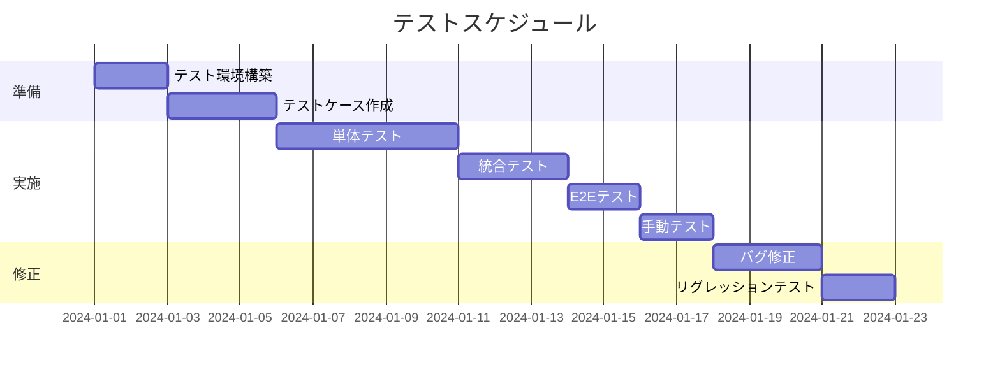

# テスト計画書

## ドキュメント情報

- **作成日**: YYYY-MM-DD
- **最終更新日**: YYYY-MM-DD
- **バージョン**: 1.0.0
- **作成者**: [あなたの名前]
- **プロジェクト**: [プロジェクト名]
- **ステータス**: Draft

## 目次

- [1. 概要](#1-概要)
- [2. テスト戦略](#2-テスト戦略)
- [3. テスト範囲](#3-テスト範囲)
- [4. テストレベル](#4-テストレベル)
- [5. テスト環境](#5-テスト環境)
- [6. テストスケジュール](#6-テストスケジュール)
- [7. テストツール](#7-テストツール)
- [8. 合格基準](#8-合格基準)
- [変更履歴](#変更履歴)
- [関連ドキュメント](#関連ドキュメント)

## 1. 概要

### 1.1 目的

このドキュメントは、プロジェクトのテスト活動の計画を定義し、品質保証の方針を明確にします。

### 1.2 対象システム

[システム/サービス名]

### 1.3 テストの目標

- すべての必須機能が正しく動作することを確認
- セキュリティ要件を満たすことを確認
- パフォーマンス要件を満たすことを確認
- ユーザビリティの問題がないことを確認

## 2. テスト戦略

### 2.1 テストアプローチ

小規模案件向けのプラグマティックなアプローチを採用します:

- **自動テスト**: 重要なロジック、API、認証周り
- **手動テスト**: UI/UX、ユーザーフロー、ブラウザ互換性
- **継続的テスト**: CI/CDパイプラインで自動実行

### 2.2 テストの優先順位

| 優先度 | 対象 | テスト方法 |
|-------|------|----------|
| 高 | 認証・認可 | 自動 + 手動 |
| 高 | データのCRUD操作 | 自動 + 手動 |
| 高 | 決済処理 (ある場合) | 自動 + 手動 |
| 中 | 検索・フィルタリング | 自動 |
| 中 | バリデーション | 自動 |
| 低 | UI/UXの細部 | 手動 |

### 2.3 テストピラミッド

```
        /\
       /  \      E2Eテスト (少)
      /    \     - 主要なユーザーフロー
     /------\
    /        \   統合テスト (中)
   /          \  - API、DB連携
  /------------\
 /              \ 単体テスト (多)
/________________\ - 関数、コンポーネント
```

## 3. テスト範囲

### 3.1 テスト対象

**機能テスト**:
- [ ] ユーザー認証 (ログイン/ログアウト/登録)
- [ ] ユーザー管理 (CRUD)
- [ ] [機能1]
- [ ] [機能2]
- [ ] [機能3]

**非機能テスト**:
- [ ] セキュリティ (認証、XSS、CSRF対策)
- [ ] パフォーマンス (レスポンスタイム)
- [ ] ブラウザ互換性
- [ ] レスポンシブデザイン

### 3.2 テスト対象外

以下は今回のテスト対象外とします:

- 負荷テスト (大規模なトラフィック想定)
- 古いブラウザ対応 (IE11など)
- アクセシビリティの完全準拠 (基本対応のみ)
- [その他対象外項目]

## 4. テストレベル

### 4.1 単体テスト (Unit Test)

**目的**: 個々の関数・コンポーネントが正しく動作することを確認

**対象**:
- ユーティリティ関数
- ビジネスロジック
- Reactコンポーネント (表示ロジック)
- バリデーション関数

**ツール**:
- Jest / Vitest
- React Testing Library (フロントエンド)
- pytest (Python の場合)

**カバレッジ目標**: 70%以上

**例**:
```typescript
// utils/validators.test.ts
describe('validateEmail', () => {
  test('valid email should return true', () => {
    expect(validateEmail('user@example.com')).toBe(true);
  });

  test('invalid email should return false', () => {
    expect(validateEmail('invalid-email')).toBe(false);
  });
});
```

### 4.2 統合テスト (Integration Test)

**目的**: モジュール間の連携が正しく動作することを確認

**対象**:
- API エンドポイント
- データベース操作
- 外部サービス連携

**ツール**:
- Supertest (API テスト)
- Testing Database (テスト用DB)

**例**:
```typescript
// api/users.test.ts
describe('POST /api/users', () => {
  test('should create user with valid data', async () => {
    const response = await request(app)
      .post('/api/users')
      .send({
        email: 'test@example.com',
        password: 'password123',
        name: 'Test User'
      });

    expect(response.status).toBe(201);
    expect(response.body.data.email).toBe('test@example.com');
  });

  test('should return error with invalid email', async () => {
    const response = await request(app)
      .post('/api/users')
      .send({
        email: 'invalid-email',
        password: 'password123',
        name: 'Test User'
      });

    expect(response.status).toBe(400);
  });
});
```

### 4.3 E2Eテスト (End-to-End Test)

**目的**: ユーザーの視点で主要なフローが正しく動作することを確認

**対象**:
- ユーザー登録フロー
- ログインフロー
- 主要な業務フロー

**ツール**:
- Playwright / Cypress

**例**:
```typescript
// e2e/auth.spec.ts
test('user can register and login', async ({ page }) => {
  // 登録ページに移動
  await page.goto('/register');

  // フォーム入力
  await page.fill('input[name="email"]', 'test@example.com');
  await page.fill('input[name="password"]', 'password123');
  await page.fill('input[name="name"]', 'Test User');

  // 登録ボタンクリック
  await page.click('button[type="submit"]');

  // ダッシュボードにリダイレクトされることを確認
  await expect(page).toHaveURL('/dashboard');
  await expect(page.locator('h1')).toContainText('Dashboard');
});
```

### 4.4 手動テスト

**目的**: 自動化が難しい部分を人間の目で確認

**対象**:
- UI/UXの品質
- デザインの確認
- レスポンシブデザイン
- ブラウザ互換性
- エラーメッセージの適切性

## 5. テスト環境

### 5.1 環境一覧

| 環境 | 用途 | URL | データベース |
|------|------|-----|------------|
| ローカル | 開発時のテスト | http://localhost:3000 | ローカルDB |
| ステージング | 本番前の検証 | https://staging.example.com | ステージングDB |
| 本番 | 最終確認 | https://example.com | 本番DB |

### 5.2 テストデータ

**テストユーザー**:
```
Email: test@example.com
Password: testpass123

Email: admin@example.com
Password: adminpass123
Role: admin
```

**テストデータ作成**:
```bash
# シードスクリプトで作成
npm run db:seed

# または手動で作成
```

### 5.3 ブラウザ環境

**必須**:
- Chrome (最新版)
- Safari (最新版)
- Firefox (最新版)
- Edge (最新版)

**デバイス**:
- Desktop (1920x1080)
- Tablet (iPad: 768x1024)
- Mobile (iPhone: 375x667)

## 6. テストスケジュール

### 6.1 テストフェーズ



### 6.2 マイルストーン

| マイルストーン | 予定日 | 成果物 |
|--------------|--------|--------|
| テスト計画完了 | YYYY-MM-DD | テスト計画書 |
| テストケース作成完了 | YYYY-MM-DD | テストケース仕様書 |
| 自動テスト完了 | YYYY-MM-DD | テストコード、カバレッジレポート |
| 手動テスト完了 | YYYY-MM-DD | テスト結果報告書 |
| バグ修正完了 | YYYY-MM-DD | 修正済みコード |
| テスト完了 | YYYY-MM-DD | 最終テスト報告書 |

## 7. テストツール

### 7.1 自動テストツール

| ツール | 用途 | 備考 |
|-------|------|------|
| Jest / Vitest | 単体・統合テスト | JavaScriptテストフレームワーク |
| React Testing Library | コンポーネントテスト | React向け |
| Supertest | APIテスト | HTTPリクエストテスト |
| Playwright | E2Eテスト | ブラウザ自動化 |
| pytest | 単体・統合テスト | Python用 |

### 7.2 テスト管理・報告

| ツール | 用途 |
|-------|------|
| GitHub Actions | CI/CD、自動テスト実行 |
| Jest Coverage | カバレッジレポート |
| [スプレッドシート] | 手動テスト結果管理 |

### 7.3 その他ツール

| ツール | 用途 |
|-------|------|
| Postman | API手動テスト |
| Chrome DevTools | ブラウザデバッグ |
| Lighthouse | パフォーマンス測定 |

## 8. 合格基準

### 8.1 自動テスト

- [ ] すべての単体テストが合格
- [ ] すべての統合テストが合格
- [ ] すべてのE2Eテストが合格
- [ ] コードカバレッジ70%以上

### 8.2 手動テスト

- [ ] すべての必須機能が動作
- [ ] クリティカルなバグ (P1) が0件
- [ ] 重要なバグ (P2) が修正済み
- [ ] すべての対象ブラウザで動作確認済み
- [ ] レスポンシブデザインが正しく表示

### 8.3 非機能要件

- [ ] ページ読み込み時間が3秒以内
- [ ] API レスポンスタイムが500ms以内
- [ ] セキュリティチェック項目がすべてクリア
- [ ] XSS、CSRF対策が実装済み

### 8.4 バグ管理基準

**バグの優先度**:
- **P1 (Critical)**: システムが使用不可、データ損失
  - 対応: 即座に修正、リリース前に必ず解決
- **P2 (High)**: 主要機能が使用不可
  - 対応: リリース前に修正
- **P3 (Medium)**: 機能は使えるが不具合あり
  - 対応: 可能な限り修正、または次回リリースで対応
- **P4 (Low)**: 軽微な問題、UI の小さな不具合
  - 対応: 時間があれば修正

**リリース判断基準**:
- P1: 0件
- P2: 0件
- P3: 3件以下
- P4: 制限なし

## 変更履歴

| バージョン | 日付 | 変更者 | 変更内容 |
|-----------|------|--------|----------|
| 1.0.0     | YYYY-MM-DD | [あなたの名前] | 初版作成 |

## 関連ドキュメント

- [要件定義書](../01_planning/requirements_specification.md)
- [テストケース仕様書](./test_case_specification.md)
- [テスト結果報告書](./test_report.md)
