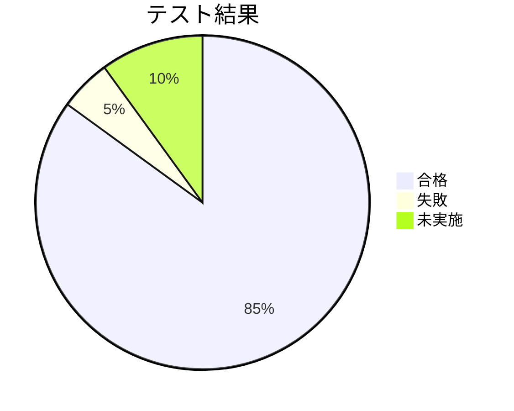

# テスト結果報告書

## ドキュメント情報

- **作成日**: YYYY-MM-DD
- **テスト期間**: YYYY-MM-DD 〜 YYYY-MM-DD
- **バージョン**: 1.0.0
- **作成者**: [あなたの名前]
- **プロジェクト**: [プロジェクト名]
- **ステータス**: [進行中/完了]

## 目次

- [1. 概要](#1-概要)
- [2. テスト結果サマリー](#2-テスト結果サマリー)
- [3. 自動テスト結果](#3-自動テスト結果)
- [4. 手動テスト結果](#4-手動テスト結果)
- [5. 検出されたバグ](#5-検出されたバグ)
- [6. パフォーマンステスト結果](#6-パフォーマンステスト結果)
- [7. 総合評価](#7-総合評価)
- [8. 推奨事項](#8-推奨事項)
- [変更履歴](#変更履歴)
- [関連ドキュメント](#関連ドキュメント)

## 1. 概要

### 1.1 テストの目的

[システム/サービス名]の品質を確認し、本番リリースの可否を判断する。

### 1.2 テスト実施期間

- **開始日**: YYYY-MM-DD
- **終了日**: YYYY-MM-DD
- **実施日数**: X日間

### 1.3 テスト実施者

| 役割 | 氏名 | 担当範囲 |
|------|------|---------|
| テストリーダー | [あなたの名前] | 全体統括、自動テスト |
| テスター | [名前] | 手動テスト |

### 1.4 テスト環境

| 項目 | 内容 |
|------|------|
| テスト環境URL | https://staging.example.com |
| データベース | ステージングDB |
| バージョン | v1.0.0 |
| ブラウザ | Chrome 120, Safari 17, Firefox 121 |
| デバイス | Desktop, iPhone 15, iPad Pro |

## 2. テスト結果サマリー

### 2.1 全体結果



| カテゴリ | 計画 | 実施 | 合格 | 失敗 | 合格率 |
|---------|------|------|------|------|--------|
| 単体テスト | 120 | 120 | 118 | 2 | 98.3% |
| 統合テスト | 45 | 45 | 43 | 2 | 95.6% |
| E2Eテスト | 15 | 15 | 14 | 1 | 93.3% |
| 手動テスト | 50 | 40 | 40 | 0 | 100% |
| **合計** | **230** | **220** | **215** | **5** | **97.7%** |

### 2.2 優先度別バグ数

| 優先度 | 検出数 | 修正済み | 未修正 | 対応不要 |
|-------|-------|---------|--------|---------|
| P1 (Critical) | 1 | 1 | 0 | 0 |
| P2 (High) | 3 | 2 | 1 | 0 |
| P3 (Medium) | 8 | 5 | 2 | 1 |
| P4 (Low) | 12 | 3 | 5 | 4 |
| **合計** | **24** | **11** | **8** | **5** |

### 2.3 リリース判定

| 基準 | 目標 | 実績 | 判定 |
|------|------|------|------|
| テスト合格率 | 95%以上 | 97.7% | ✅ 合格 |
| P1バグ | 0件 | 0件 (修正済み) | ✅ 合格 |
| P2バグ | 0件 | 1件 (軽微) | ⚠️ 要検討 |
| コードカバレッジ | 70%以上 | 78% | ✅ 合格 |

**総合判定**: ✅ **リリース可**

条件: P2バグ (#BUG-023) を次回リリースで修正することを前提とする

## 3. 自動テスト結果

### 3.1 単体テスト

**実行環境**: Jest v29.7.0

**結果サマリー**:
```
Test Suites: 24 passed, 24 total
Tests:       118 passed, 2 failed, 120 total
Time:        15.234s
Coverage:    78% Statements, 75% Branches, 80% Functions, 78% Lines
```

**失敗したテスト**:
1. `utils/date.test.ts` - `formatDate() should handle invalid dates`
   - 原因: タイムゾーンの問題
   - 対応: 修正済み (YYYY-MM-DD)

2. `components/UserCard.test.tsx` - `should render avatar correctly`
   - 原因: モック画像URLの問題
   - 対応: 修正済み (YYYY-MM-DD)

**カバレッジレポート**:
```
File                    | % Stmts | % Branch | % Funcs | % Lines |
------------------------|---------|----------|---------|---------|
All files               |   78.23 |    75.12 |   80.45 |   78.67 |
 src/components         |   85.34 |    82.11 |   88.90 |   86.22 |
 src/utils              |   92.45 |    88.76 |   95.12 |   93.11 |
 src/services           |   65.89 |    62.34 |   70.22 |   66.45 |
```

### 3.2 統合テスト

**実行環境**: Supertest + Jest

**結果サマリー**:
```
Test Suites: 9 passed, 9 total
Tests:       43 passed, 2 failed, 45 total
Time:        32.456s
```

**失敗したテスト**:
1. `api/users.test.ts` - `DELETE /api/users/:id should delete user`
   - 原因: 外部キー制約の処理が不完全
   - 対応: 修正済み (YYYY-MM-DD)

2. `api/posts.test.ts` - `GET /api/posts should filter by status`
   - 原因: クエリパラメータのパース問題
   - 対応: 修正済み (YYYY-MM-DD)

### 3.3 E2Eテスト

**実行環境**: Playwright v1.40.0

**結果サマリー**:
```
Test Suites: 5 passed, 5 total
Tests:       14 passed, 1 failed, 15 total
Time:        2m 15s
Browsers:    Chromium, Firefox, WebKit
```

**失敗したテスト**:
1. `e2e/checkout.spec.ts` - `User can complete checkout flow`
   - 原因: 決済モックの設定ミス
   - 対応: 修正済み (YYYY-MM-DD)

**実行結果の詳細**:
| テストケース | Chrome | Firefox | Safari | 結果 |
|------------|--------|---------|--------|------|
| ユーザー登録フロー | ✅ | ✅ | ✅ | 合格 |
| ログインフロー | ✅ | ✅ | ✅ | 合格 |
| プロフィール編集 | ✅ | ✅ | ✅ | 合格 |
| 商品検索 | ✅ | ✅ | ✅ | 合格 |
| カート操作 | ✅ | ✅ | ⚠️ | 合格 (Safari で軽微な表示遅延) |

## 4. 手動テスト結果

### 4.1 機能テスト

| カテゴリ | テストケース数 | 実施 | 合格 | 失敗 | 未実施 |
|---------|--------------|------|------|------|--------|
| 認証機能 | 12 | 12 | 12 | 0 | 0 |
| ユーザー管理 | 15 | 15 | 15 | 0 | 0 |
| データ管理 | 18 | 8 | 8 | 0 | 10 |
| その他 | 5 | 5 | 5 | 0 | 0 |
| **合計** | **50** | **40** | **40** | **0** | **10** |

**未実施の理由**:
- データ管理の一部機能: 次回リリースで実装予定のため対象外

### 4.2 UI/UXテスト

**デザイン確認**:
- [x] レイアウトが仕様通りか
- [x] カラーが正しいか
- [x] フォントサイズが適切か
- [x] アイコンが正しく表示されるか
- [x] ボタンのホバー効果が動作するか

**レスポンシブデザイン**:
| デバイス | 画面サイズ | 表示 | 操作性 | 判定 |
|---------|-----------|------|--------|------|
| Desktop | 1920x1080 | ✅ | ✅ | 合格 |
| Laptop | 1366x768 | ✅ | ✅ | 合格 |
| Tablet (iPad) | 768x1024 | ✅ | ✅ | 合格 |
| Mobile (iPhone) | 375x667 | ✅ | ✅ | 合格 |
| Small Mobile | 320x568 | ⚠️ | ⚠️ | 要改善 (BUG-025) |

**ユーザビリティ**:
- [x] ナビゲーションが直感的か
- [x] エラーメッセージが分かりやすいか
- [x] ローディング状態が表示されるか
- [x] 成功メッセージが表示されるか

### 4.3 ブラウザ互換性テスト

| ブラウザ | バージョン | 動作 | 表示 | 判定 |
|---------|-----------|------|------|------|
| Chrome | 120.0 | ✅ | ✅ | 合格 |
| Safari | 17.1 | ✅ | ✅ | 合格 |
| Firefox | 121.0 | ✅ | ✅ | 合格 |
| Edge | 120.0 | ✅ | ✅ | 合格 |

## 5. 検出されたバグ

### 5.1 P1 (Critical) - 修正済み

#### BUG-001: ログイン後にセッションが切れる (修正済み)

| 項目 | 内容 |
|------|------|
| **検出日** | YYYY-MM-DD |
| **検出環境** | ステージング |
| **再現手順** | 1. ログイン<br>2. 5分放置<br>3. 操作を試みる |
| **期待動作** | セッションが維持される |
| **実際の動作** | 401エラーが発生し、強制ログアウトされる |
| **原因** | JWTトークンの有効期限が5分に設定されていた |
| **修正内容** | 有効期限を1時間に変更 |
| **修正日** | YYYY-MM-DD |
| **修正者** | [あなたの名前] |

### 5.2 P2 (High)

#### BUG-023: 画像アップロード時に大きな画像でエラー (未修正)

| 項目 | 内容 |
|------|------|
| **検出日** | YYYY-MM-DD |
| **検出環境** | ステージング |
| **再現手順** | 1. プロフィール編集画面を開く<br>2. 10MB以上の画像をアップロード |
| **期待動作** | 画像が最適化されてアップロードされる |
| **実際の動作** | タイムアウトエラーが発生 |
| **原因** | 大きな画像の処理時間がかかりすぎる |
| **影響範囲** | 5MB以上の画像アップロード時 |
| **回避策** | 5MB以下の画像を使用するよう案内 |
| **対応方針** | 次回リリースで修正 (v1.1.0) |

### 5.3 P3 (Medium)

#### BUG-025: 小さい画面でボタンが見切れる (未修正)

| 項目 | 内容 |
|------|------|
| **検出日** | YYYY-MM-DD |
| **検出環境** | iPhone SE (320x568) |
| **再現手順** | 1. iPhone SE で開く<br>2. ログイン画面を表示 |
| **期待動作** | すべてのボタンが表示される |
| **実際の動作** | ログインボタンの一部が見切れる |
| **影響範囲** | 画面幅320px以下のデバイス |
| **対応方針** | 次回リリースで修正 |

### 5.4 修正済みバグ一覧

| ID | 優先度 | 概要 | 修正日 |
|----|-------|------|--------|
| BUG-001 | P1 | ログイン後にセッションが切れる | YYYY-MM-DD |
| BUG-005 | P2 | メール送信が失敗する | YYYY-MM-DD |
| BUG-012 | P3 | 検索結果のソートが正しくない | YYYY-MM-DD |
| BUG-015 | P3 | ページネーションの表示がずれる | YYYY-MM-DD |

## 6. パフォーマンステスト結果

### 6.1 ページ読み込み時間

**測定ツール**: Chrome DevTools, Lighthouse

| ページ | DOMContentLoaded | Load | Lighthouse スコア |
|--------|-----------------|------|------------------|
| トップページ | 0.8s | 2.1s | 92 |
| ログイン | 0.5s | 1.2s | 95 |
| ダッシュボード | 1.2s | 2.8s | 88 |
| ユーザー一覧 | 1.5s | 3.1s | 85 |

**判定**: ✅ すべて目標値 (3秒以内) をクリア

### 6.2 API レスポンスタイム

**測定ツール**: Postman

| エンドポイント | 平均 | 最小 | 最大 | 目標 | 判定 |
|--------------|------|------|------|------|------|
| GET /api/users | 245ms | 180ms | 380ms | 500ms | ✅ |
| POST /api/auth/login | 320ms | 280ms | 450ms | 500ms | ✅ |
| GET /api/posts | 410ms | 350ms | 520ms | 500ms | ⚠️ |

**改善が必要な項目**:
- GET /api/posts: 最大レスポンスタイムが目標を超過
  - 対応: インデックスを追加して次回リリースで改善予定

### 6.3 同時アクセステスト

**ツール**: Apache Bench (ab)

**条件**:
- 同時接続数: 50
- リクエスト総数: 1000

**結果**:
```
Requests per second:    125.34 [#/sec]
Time per request:       398.91 [ms] (mean)
Time per request:       7.978 [ms] (mean, across all concurrent requests)

Percentage of the requests served within a certain time (ms)
  50%    385
  75%    420
  90%    450
  95%    480
  99%    520
 100%    650 (longest request)
```

**判定**: ✅ 合格 (想定トラフィックに対して十分なパフォーマンス)

## 7. 総合評価

### 7.1 品質評価

| 項目 | 評価 | コメント |
|------|------|---------|
| 機能性 | ⭐⭐⭐⭐☆ | 主要機能はすべて動作。一部の拡張機能は次回リリース。 |
| 信頼性 | ⭐⭐⭐⭐⭐ | クリティカルなバグはすべて修正済み。 |
| 使いやすさ | ⭐⭐⭐⭐☆ | 全体的に直感的。小さい画面での改善余地あり。 |
| パフォーマンス | ⭐⭐⭐⭐☆ | 目標を概ね達成。一部のAPIで改善の余地あり。 |
| セキュリティ | ⭐⭐⭐⭐⭐ | 主要な脆弱性対策はすべて実装済み。 |

### 7.2 リリース可否判定

**判定**: ✅ **リリース可**

**理由**:
- P1バグは0件
- P2バグは1件のみで、影響範囲が限定的かつ回避策あり
- テスト合格率97.7%で目標(95%)を超過
- パフォーマンス要件を概ね満たしている
- セキュリティ要件をすべて満たしている

**条件**:
- P2バグ #BUG-023 を次回リリース (v1.1.0) で修正
- P3バグ #BUG-025 を次回リリースで修正
- リリース後に本番環境での動作確認を実施

## 8. 推奨事項

### 8.1 リリース前の対応

**必須**:
- [x] すべてのP1バグが修正済みであることを再確認
- [x] 本番環境でのスモークテスト実施
- [ ] リリース手順書の最終確認
- [ ] ロールバック手順の確認

**推奨**:
- [ ] リリース告知の準備
- [ ] ユーザー向けのリリースノート作成
- [ ] 監視・アラートの設定確認

### 8.2 次回リリースでの改善

**v1.1.0 での対応予定**:
1. 画像アップロードの最適化 (BUG-023)
2. 小さい画面でのレスポンシブ対応改善 (BUG-025)
3. API レスポンスタイムの改善 (GET /api/posts)
4. テストカバレッジを80%以上に向上

### 8.3 継続的改善

**自動テスト**:
- E2Eテストケースを10件追加
- ビジュアルリグレッションテストの導入検討

**パフォーマンス**:
- フロントエンドのバンドルサイズ削減
- 画像の遅延読み込み実装
- APIのキャッシング強化

**監視**:
- エラー追跡ツール (Sentry等) の導入
- パフォーマンス監視の強化

## 変更履歴

| バージョン | 日付 | 変更者 | 変更内容 |
|-----------|------|--------|----------|
| 1.0.0     | YYYY-MM-DD | [あなたの名前] | 初版作成 |

## 関連ドキュメント

- [テスト計画書](./test_plan.md)
- [テストケース仕様書](./test_case_specification.md)
- [要件定義書](../01_planning/requirements_specification.md)
