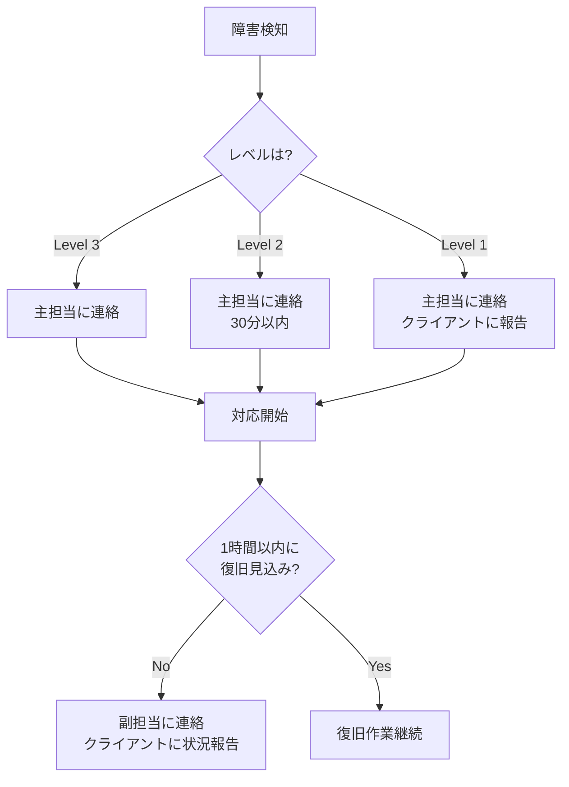
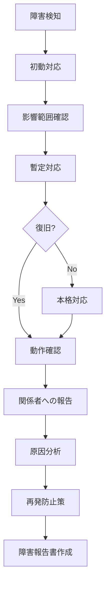

# 障害対応手順書

## ドキュメント情報

- **作成日**: YYYY-MM-DD
- **最終更新日**: YYYY-MM-DD
- **バージョン**: 1.0.0
- **作成者**: [あなたの名前]
- **プロジェクト**: [プロジェクト名]
- **ステータス**: Draft

## 目次

- [1. 概要](#1-概要)
- [2. 障害対応フロー](#2-障害対応フロー)
- [3. 障害レベル定義](#3-障害レベル定義)
- [4. 初動対応](#4-初動対応)
- [5. 障害別対応手順](#5-障害別対応手順)
- [6. 復旧後対応](#6-復旧後対応)
- [7. 障害報告書テンプレート](#7-障害報告書テンプレート)
- [変更履歴](#変更履歴)
- [関連ドキュメント](#関連ドキュメント)

## 1. 概要

### 1.1 目的

このドキュメントは、システム障害発生時の対応手順を定義し、迅速な復旧と再発防止を実現します。

### 1.2 対象者

- 開発者
- 運用担当者
- クライアント (必要に応じて)

### 1.3 緊急連絡先

| 役割 | 氏名 | 連絡方法 | 対応可能時間 |
|------|------|---------|-------------|
| **主担当** | [あなたの名前] | 携帯: 090-XXXX-XXXX<br>メール: your@email.com<br>Slack: @your-name | 24時間 (緊急時) |
| **クライアント** | [担当者名] | メール: client@example.com<br>電話: 03-XXXX-XXXX | 営業時間内 |
| **副担当** | [名前] | メール: backup@example.com | 平日 10:00-18:00 |

### 1.4 エスカレーションルール



## 2. 障害対応フロー

### 2.1 全体フロー



### 2.2 対応タイムライン

| フェーズ | 目標時間 | アクション |
|---------|---------|-----------|
| 検知 | 0分 | 監視システムまたはユーザー報告で検知 |
| 初動対応 | 5分以内 | 状況確認、影響範囲特定 |
| 暫定対応 | 15分以内 | ロールバックまたは緊急修正 |
| 復旧確認 | 30分以内 | 正常動作の確認 |
| 本格対応 | 2時間以内 | 根本原因の修正 |
| 報告 | 4時間以内 | 障害報告書の作成・共有 |

## 3. 障害レベル定義

### 3.1 レベル1 (Critical - 致命的)

**定義**:
- サービス全体が停止している
- 大量のユーザーに影響
- データ損失のリスク
- セキュリティ侵害

**例**:
- Webサイトが完全にダウン
- データベースに接続できない
- 個人情報の流出

**対応**:
- 即座に対応開始
- クライアントに即座に連絡
- 必要に応じてメンテナンスページを表示
- 1時間以内に暫定復旧

### 3.2 レベル2 (High - 重大)

**定義**:
- 主要機能が使用不可
- 一部のユーザーに影響
- 業務に支障

**例**:
- ログインができない
- 決済処理ができない
- 特定ページが500エラー

**対応**:
- 30分以内に対応開始
- クライアントに状況報告
- 2時間以内に復旧

### 3.3 レベル3 (Medium - 中程度)

**定義**:
- 一部機能に不具合
- 限定的なユーザーに影響
- 回避策が存在

**例**:
- 画像が表示されない
- 検索結果が正しくない
- UI の表示崩れ

**対応**:
- 1時間以内に対応開始
- 次回デプロイで修正
- 必要に応じてクライアントに報告

### 3.4 レベル4 (Low - 軽微)

**定義**:
- 軽微な不具合
- ユーザー影響が極めて限定的
- 緊急性なし

**例**:
- タイポ
- リンク切れ
- スタイルの微調整

**対応**:
- 計画的に修正
- 次回メンテナンス時に対応

## 4. 初動対応

### 4.1 状況確認チェックリスト

```bash
# 1. サイトにアクセスできるか
curl -I https://example.com

# 2. API が応答するか
curl https://example.com/api/health

# 3. データベースに接続できるか
psql $DATABASE_URL -c "SELECT 1;"

# 4. エラーログを確認
railway logs --tail 100

# 5. 監視ツールを確認
# - UptimeRobot
# - Vercel Analytics
# - Railway Metrics
```

### 4.2 初動対応シート

**障害発生日時**: YYYY-MM-DD HH:MM

**検知方法**:
- [ ] 監視アラート
- [ ] ユーザー報告
- [ ] 開発者が発見
- [ ] その他: ___________

**影響範囲**:
- [ ] サービス全体
- [ ] 特定機能のみ
- [ ] 特定ユーザーのみ

**緊急度**:
- [ ] Level 1 (Critical)
- [ ] Level 2 (High)
- [ ] Level 3 (Medium)
- [ ] Level 4 (Low)

**初動アクション**:
- [ ] 関係者に連絡
- [ ] ログ確認
- [ ] 直前の変更を確認
- [ ] ロールバック準備

### 4.3 関係者への連絡

**Level 1 の場合 (即座)**:
```
【緊急】システム障害発生のお知らせ

発生日時: YYYY-MM-DD HH:MM
影響範囲: [詳細]
現在の状況: [状況]
復旧見込み: 調査中

対応状況は随時更新いたします。
```

**Level 2 の場合 (30分以内)**:
```
【重要】システム不具合のお知らせ

発生日時: YYYY-MM-DD HH:MM
影響範囲: [詳細]
現在の状況: [状況]
回避策: [あれば記載]

復旧作業を進めております。
```

## 5. 障害別対応手順

### 5.1 サイト全体がダウン

**症状**: https://example.com にアクセスできない

**原因候補**:
1. デプロイの失敗
2. DNSの問題
3. インフラの障害
4. サーバーのクラッシュ

**対応手順**:
```bash
# 1. Vercel のステータス確認
# https://www.vercel-status.com/

# 2. DNS の確認
dig example.com

# 3. 直前のデプロイをロールバック
# Vercel Dashboard > Deployments > 前回のデプロイ > Promote to Production

# 4. エラーログ確認
vercel logs

# 5. 復旧確認
curl -I https://example.com
```

### 5.2 APIエラー (500エラー)

**症状**: API が500エラーを返す

**原因候補**:
1. コードのバグ
2. データベース接続エラー
3. 環境変数の設定ミス
4. メモリ不足

**対応手順**:
```bash
# 1. エラーログ確認
railway logs | grep "ERROR"

# 2. データベース接続確認
psql $DATABASE_URL -c "SELECT 1;"

# 3. 環境変数確認
railway variables

# 4. 直前のコミットをロールバック
git revert HEAD
git push origin main

# 5. リソース使用状況確認
# Railway Dashboard > Metrics
```

### 5.3 データベース接続エラー

**症状**: "Connection refused" または "Too many connections"

**原因候補**:
1. データベースサーバーのダウン
2. 接続数の上限到達
3. 認証情報の不一致
4. ネットワークの問題

**対応手順**:
```bash
# 1. Supabase のステータス確認
# Supabase Dashboard

# 2. 接続確認
psql $DATABASE_URL -c "SELECT 1;"

# 3. 接続数確認
psql $DATABASE_URL -c "SELECT count(*) FROM pg_stat_activity;"

# 4. アイドル接続の削除
psql $DATABASE_URL -c "
SELECT pg_terminate_backend(pid)
FROM pg_stat_activity
WHERE state = 'idle'
AND state_change < now() - interval '5 minutes';
"

# 5. アプリケーションの再起動
railway restart
```

### 5.4 ログインできない

**症状**: ユーザーがログインできない

**原因候補**:
1. 認証サービスの障害
2. JWTシークレットの変更
3. セッション管理の問題
4. データベースの問題

**対応手順**:
```bash
# 1. 認証APIの確認
curl -X POST https://example.com/api/auth/login \
  -H "Content-Type: application/json" \
  -d '{"email":"test@example.com","password":"test123"}'

# 2. エラーログ確認
railway logs | grep "auth"

# 3. 環境変数 (JWT_SECRET) の確認
railway variables | grep JWT

# 4. 特定ユーザーの状態確認
psql $DATABASE_URL -c "SELECT * FROM users WHERE email='test@example.com';"

# 5. セッションテーブルの確認 (あれば)
psql $DATABASE_URL -c "SELECT * FROM sessions WHERE user_id = 123;"
```

### 5.5 メール送信失敗

**症状**: 登録確認メールが届かない

**原因候補**:
1. メールサービスの障害
2. API キーの期限切れ
3. 送信上限到達
4. メールアドレスの問題

**対応手順**:
```bash
# 1. SendGrid のステータス確認
# https://status.sendgrid.com/

# 2. SendGrid Dashboard で確認
# Activity > Email Activity

# 3. APIキーの確認
railway variables | grep SENDGRID

# 4. 送信数の確認
# SendGrid Dashboard > Analytics

# 5. テストメール送信
curl -X POST https://example.com/api/test/send-email
```

### 5.6 パフォーマンス低下

**症状**: ページの読み込みが極端に遅い

**原因候補**:
1. データベースのスロークエリ
2. N+1 問題
3. キャッシュの無効化
4. リソース不足

**対応手順**:
```bash
# 1. レスポンスタイム確認
curl -w "@curl-format.txt" -o /dev/null -s https://example.com/api/users

# curl-format.txt
# time_total: %{time_total}

# 2. スロークエリの確認
psql $DATABASE_URL -c "
SELECT query, calls, total_time, mean_time
FROM pg_stat_statements
ORDER BY mean_time DESC
LIMIT 10;
"

# 3. リソース使用状況
# Railway Dashboard > Metrics (CPU, Memory)

# 4. ログで遅いエンドポイントを特定
railway logs | grep "slow"

# 5. 一時的にキャッシュを強化
# または問題のあるエンドポイントを一時無効化
```

## 6. 復旧後対応

### 6.1 動作確認チェックリスト

- [ ] トップページが表示される
- [ ] ログインができる
- [ ] 主要機能が動作する
- [ ] API が正常に応答する
- [ ] データベースに接続できる
- [ ] エラーログに異常がない

### 6.2 復旧報告

**クライアントへの報告例**:
```
【復旧完了】システム障害について

発生日時: YYYY-MM-DD HH:MM - HH:MM
影響範囲: [詳細]
原因: [原因]
対応内容: [対応内容]

現在は正常に稼働しております。
ご迷惑をおかけし、申し訳ございませんでした。

詳細な報告書は後日提出いたします。
```

### 6.3 振り返りミーティング

**実施タイミング**: 復旧後24時間以内

**アジェンダ**:
1. 障害の概要
2. タイムライン
3. 根本原因
4. 対応の良かった点・悪かった点
5. 再発防止策
6. アクションアイテム

## 7. 障害報告書テンプレート

```markdown
# 障害報告書

## 基本情報

- **障害ID**: INC-YYYYMMDD-001
- **発生日時**: YYYY-MM-DD HH:MM
- **復旧日時**: YYYY-MM-DD HH:MM
- **影響時間**: X時間Y分
- **障害レベル**: Level 1/2/3/4
- **報告者**: [あなたの名前]
- **報告日**: YYYY-MM-DD

## 概要

[障害の概要を1-2文で記述]

## 影響範囲

- **影響ユーザー数**: 約X名 (推定)
- **影響機能**: [機能名]
- **データ損失**: あり/なし

## タイムライン

| 時刻 | イベント |
|------|---------|
| HH:MM | 障害発生 |
| HH:MM | 障害検知 |
| HH:MM | 対応開始 |
| HH:MM | 暫定復旧 |
| HH:MM | 完全復旧 |
| HH:MM | 復旧確認完了 |

## 根本原因

[障害の根本原因を詳しく記述]

**技術的詳細**:
- [詳細1]
- [詳細2]

## 対応内容

### 暫定対応
[緊急で実施した対応]

### 本格対応
[根本的な修正内容]

## 再発防止策

### 即時対応 (完了済み)
- [x] [対策1]
- [x] [対策2]

### 短期対応 (1週間以内)
- [ ] [対策1]
- [ ] [対策2]

### 中長期対応 (1ヶ月以内)
- [ ] [対策1]
- [ ] [対策2]

## 教訓

### うまくいった点
- [良かった点1]
- [良かった点2]

### 改善が必要な点
- [改善点1]
- [改善点2]

## 添付資料

- エラーログ: [リンク]
- スクリーンショット: [リンク]
- 関連チケット: [リンク]
```

## 変更履歴

| バージョン | 日付 | 変更者 | 変更内容 |
|-----------|------|--------|----------|
| 1.0.0     | YYYY-MM-DD | [あなたの名前] | 初版作成 |

## 関連ドキュメント

- [運用手順書](./operation_manual.md)
- [保守・メンテナンス計画書](./maintenance_plan.md)
- [システム設計書](../02_design/system_design.md)
