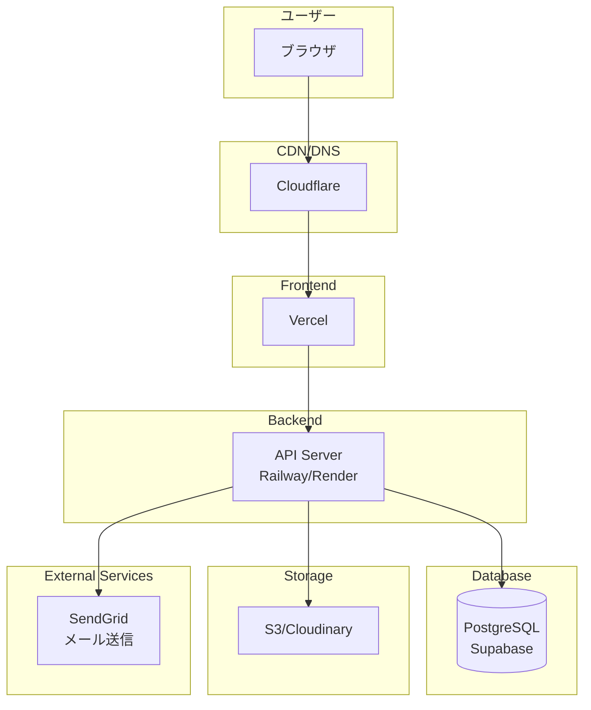
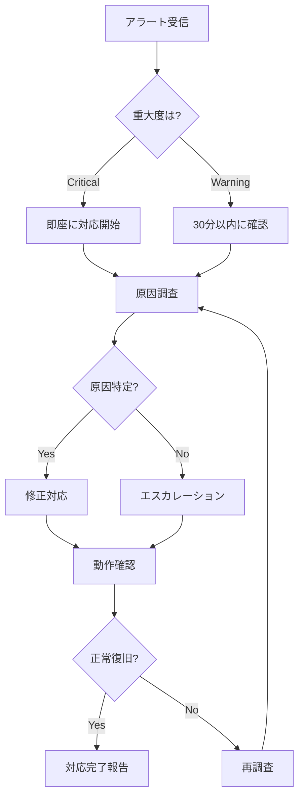

# 運用手順書

## ドキュメント情報

- **作成日**: YYYY-MM-DD
- **最終更新日**: YYYY-MM-DD
- **バージョン**: 1.0.0
- **作成者**: [あなたの名前]
- **プロジェクト**: [プロジェクト名]
- **ステータス**: Draft

## 目次

- [1. 概要](#1-概要)
- [2. システム構成](#2-システム構成)
- [3. デプロイ手順](#3-デプロイ手順)
- [4. 日常運用](#4-日常運用)
- [5. バックアップ・リストア](#5-バックアップリストア)
- [6. 監視とアラート](#6-監視とアラート)
- [7. ログ管理](#7-ログ管理)
- [8. よくある操作](#8-よくある操作)
- [変更履歴](#変更履歴)
- [関連ドキュメント](#関連ドキュメント)

## 1. 概要

### 1.1 目的

このドキュメントは、[システム/サービス名]の日常運用に必要な手順を記載します。

### 1.2 対象者

- 開発者
- 運用担当者
- クライアント (必要に応じて)

### 1.3 緊急連絡先

| 役割 | 氏名 | 連絡先 | 対応時間 |
|------|------|--------|---------|
| 主担当 | [あなたの名前] | メール: your@email.com<br>電話: 090-XXXX-XXXX | 平日 10:00-18:00 |
| クライアント窓口 | [担当者名] | メール: client@example.com | 営業時間内 |

### 1.4 重要なURL

| 項目 | URL | 備考 |
|------|-----|------|
| 本番環境 | https://example.com | 一般公開 |
| 管理画面 | https://example.com/admin | 要認証 |
| ステージング環境 | https://staging.example.com | 検証用 |
| GitHub リポジトリ | https://github.com/user/repo | ソースコード |
| デプロイ管理 | https://vercel.com/project | Vercel Dashboard |

## 2. システム構成

### 2.1 システム概要図



### 2.2 インフラ構成

| コンポーネント | サービス | プラン | 月額費用 |
|--------------|---------|-------|---------|
| フロントエンド | Vercel | Pro | $20 |
| バックエンド | Railway | Hobby | $5 |
| データベース | Supabase | Free | $0 |
| ストレージ | Cloudinary | Free | $0 |
| ドメイン | Cloudflare | Free | $0 |
| メール | SendGrid | Free (100通/日) | $0 |
| **合計** | | | **$25/月** |

### 2.3 アクセス情報

**重要**: 以下の情報は安全な場所に保管してください (1Password, LastPass等)

| サービス | アカウント | アクセス方法 |
|---------|-----------|------------|
| Vercel | [メールアドレス] | GitHub連携 |
| Railway | [メールアドレス] | GitHub連携 |
| Supabase | [メールアドレス] | パスワード認証 |
| Cloudinary | [メールアドレス] | パスワード認証 |
| AWS (S3) | [アクセスキーID] | IAMキー |

## 3. デプロイ手順

### 3.1 通常デプロイ (自動)

**フロントエンド**:
```bash
# main ブランチへのマージで自動デプロイ
git checkout main
git pull origin main
git merge feature/new-feature
git push origin main

# Vercel が自動でビルド・デプロイ
# URL: https://vercel.com/project/deployments で確認
```

**バックエンド**:
```bash
# main ブランチへのマージで自動デプロイ
git checkout main
git merge feature/new-feature
git push origin main

# Railway が自動でビルド・デプロイ
# URL: https://railway.app/project で確認
```

### 3.2 手動デプロイ

**フロントエンド (Vercel CLI)**:
```bash
# Vercel CLI のインストール
npm install -g vercel

# デプロイ
cd frontend
vercel --prod

# ログイン (初回のみ)
# GitHub 連携を選択
```

**バックエンド (Railway CLI)**:
```bash
# Railway CLI のインストール
npm install -g railway

# ログイン
railway login

# デプロイ
cd backend
railway up
```

### 3.3 デプロイ前チェックリスト

- [ ] ローカルでテストが通ることを確認
- [ ] コンフリクトが解消されている
- [ ] マイグレーションファイルがある場合、事前に実行計画を確認
- [ ] 環境変数の変更がある場合、事前に設定
- [ ] ステージング環境で動作確認済み

### 3.4 デプロイ後チェックリスト

- [ ] デプロイが成功したことを確認
- [ ] 本番環境でスモークテスト実行
  - トップページが表示される
  - ログインできる
  - 主要機能が動作する
- [ ] エラーログを確認 (異常なエラーがないか)
- [ ] パフォーマンスを確認 (極端に遅くなっていないか)

### 3.5 ロールバック手順

**Vercel**:
```bash
# Vercel Dashboard から:
# 1. Deployments タブを開く
# 2. 直前の正常なデプロイを選択
# 3. "Promote to Production" をクリック
```

**Railway**:
```bash
# Railway Dashboard から:
# 1. Deployments を開く
# 2. 直前の正常なデプロイを選択
# 3. "Redeploy" をクリック
```

**緊急時 (コマンドライン)**:
```bash
# 直前のコミットに戻す
git revert HEAD
git push origin main

# または特定のコミットに戻す
git revert <commit-hash>
git push origin main
```

## 4. 日常運用

### 4.1 日次作業

**毎朝 (10:00)**:
- [ ] システムが正常に稼働しているか確認
  - 本番環境にアクセスして動作確認
  - エラーログを確認
- [ ] 前日のアクセス数を確認 (Google Analytics等)
- [ ] メール送信が正常に動作しているか確認

**毎夕 (18:00)**:
- [ ] 当日のデプロイがあった場合、動作確認
- [ ] エラーログの最終確認

### 4.2 週次作業

**毎週月曜日**:
- [ ] データベースのバックアップを確認
- [ ] ディスク使用量を確認
- [ ] 前週のエラーログをレビュー
- [ ] セキュリティアップデートの確認

### 4.3 月次作業

**毎月1日**:
- [ ] インフラコストの確認
- [ ] 外部サービスの利用状況確認
- [ ] SSL証明書の有効期限確認 (3ヶ月前から)
- [ ] ドメインの更新期限確認 (3ヶ月前から)

### 4.4 定期メンテナンス

**月1回 (第1日曜日 深夜2:00-4:00)**:
- データベースのメンテナンス
- 不要なログファイルの削除
- パフォーマンスチューニング

**メンテナンス告知例**:
```
【メンテナンスのお知らせ】

日時: YYYY年MM月DD日 2:00-4:00 (予定)
影響: この時間帯はサービスが利用できません
内容: データベースメンテナンス

ご不便をおかけしますが、よろしくお願いいたします。
```

## 5. バックアップ・リストア

### 5.1 バックアップ戦略

**自動バックアップ (Supabase)**:
- 頻度: 日次 (深夜2:00)
- 保持期間: 7日間
- 場所: Supabase 自動バックアップ

**手動バックアップ**:
```bash
# PostgreSQL のバックアップ
pg_dump $DATABASE_URL > backup_$(date +%Y%m%d).sql

# S3 にアップロード (推奨)
aws s3 cp backup_$(date +%Y%m%d).sql s3://your-bucket/backups/
```

### 5.2 リストア手順

**データベースのリストア**:
```bash
# 1. バックアップファイルを取得
aws s3 cp s3://your-bucket/backups/backup_20240101.sql ./

# 2. データベースをリストア (注意: 既存データは削除されます)
psql $DATABASE_URL < backup_20240101.sql

# 3. 動作確認
psql $DATABASE_URL -c "SELECT COUNT(*) FROM users;"
```

**注意事項**:
- 本番環境へのリストアは慎重に実施
- 必ず事前にバックアップを取得
- ステージング環境で事前にテスト

### 5.3 災害復旧 (DR)

**復旧手順**:
1. 被害状況の確認
2. 関係者への連絡
3. バックアップからのリストア
4. データの整合性確認
5. サービスの再開
6. 事後報告書の作成

**目標復旧時間 (RTO)**: 4時間以内
**目標復旧ポイント (RPO)**: 24時間以内

## 6. 監視とアラート

### 6.1 監視項目

**アプリケーション監視**:
- [ ] Webサイトの応答 (死活監視)
- [ ] API のレスポンスタイム
- [ ] エラー率
- [ ] ログインエラー率

**インフラ監視**:
- [ ] サーバーのCPU使用率
- [ ] メモリ使用率
- [ ] ディスク使用率
- [ ] データベース接続数

### 6.2 監視ツール

| ツール | 用途 | URL |
|-------|------|-----|
| UptimeRobot | 死活監視 | https://uptimerobot.com |
| Vercel Analytics | フロントエンド監視 | Vercel Dashboard |
| Railway Metrics | バックエンド監視 | Railway Dashboard |
| Supabase Dashboard | DB監視 | Supabase Dashboard |

### 6.3 アラート設定

**UptimeRobot設定**:
```
監視URL: https://example.com
間隔: 5分
アラート: メール (your@email.com)
```

**アラート基準**:
- サイトが5分間応答しない → 即座にアラート
- エラー率が5%を超える → 即座にアラート
- CPU使用率が80%を超える → 警告
- ディスク使用率が80%を超える → 警告

### 6.4 アラート対応フロー



## 7. ログ管理

### 7.1 ログの種類

| ログ種別 | 場所 | 保持期間 |
|---------|------|---------|
| アプリケーションログ | Vercel/Railway | 7日間 |
| アクセスログ | Vercel Analytics | 30日間 |
| エラーログ | コンソール | 7日間 |
| データベースログ | Supabase | 7日間 |

### 7.2 ログの確認方法

**Vercel (フロントエンド)**:
```bash
# Vercel CLI でログ確認
vercel logs

# または Dashboard で確認
# https://vercel.com/project/logs
```

**Railway (バックエンド)**:
```bash
# Railway CLI でログ確認
railway logs

# リアルタイム表示
railway logs --follow
```

**データベース (Supabase)**:
```sql
-- スロークエリの確認
SELECT * FROM pg_stat_statements
ORDER BY total_time DESC
LIMIT 10;
```

### 7.3 ログ分析

**よく確認するログ**:
```bash
# エラーログのみ抽出
railway logs | grep "ERROR"

# 特定のエンドポイントのログ
railway logs | grep "/api/users"

# 過去1時間のログ
railway logs --since 1h
```

## 8. よくある操作

### 8.1 環境変数の更新

**Vercel**:
```bash
# Dashboard から:
# Settings > Environment Variables
# 変数を追加・更新後、Redeploy
```

**Railway**:
```bash
# Dashboard から:
# Variables タブ
# 変数を追加・更新 (自動で再デプロイ)
```

### 8.2 データベース操作

**接続**:
```bash
# psql で接続
psql $DATABASE_URL

# または Supabase Dashboard の SQL Editor を使用
```

**よく使うクエリ**:
```sql
-- ユーザー数を確認
SELECT COUNT(*) FROM users;

-- 最新のユーザーを確認
SELECT * FROM users ORDER BY created_at DESC LIMIT 10;

-- 特定のユーザーを検索
SELECT * FROM users WHERE email = 'user@example.com';

-- テーブルサイズを確認
SELECT
    schemaname,
    tablename,
    pg_size_pretty(pg_total_relation_size(schemaname||'.'||tablename)) AS size
FROM pg_tables
WHERE schemaname = 'public'
ORDER BY pg_total_relation_size(schemaname||'.'||tablename) DESC;
```

### 8.3 ユーザーサポート

**パスワードリセット**:
```sql
-- 管理者が手動でリセットする場合
-- 1. 一時パスワードを生成
-- 2. ハッシュ化
-- 3. 更新
UPDATE users
SET password_hash = '[bcrypt hash]'
WHERE email = 'user@example.com';
```

**アカウント削除**:
```sql
-- ユーザーを削除 (関連データも自動削除される)
DELETE FROM users WHERE id = 123;
```

### 8.4 キャッシュクリア

**Cloudflare キャッシュクリア**:
```bash
# Dashboard から:
# Caching > Configuration > Purge Everything
```

**CDN キャッシュクリア**:
```bash
# Vercel で自動的にパージされる
# 手動で実施する場合は Redeploy
```

### 8.5 SSL証明書の更新

**Vercel/Railway**:
- 自動更新 (Let's Encrypt)
- 対応不要

**カスタムドメイン**:
```bash
# Cloudflare で自動更新
# 証明書の有効期限は Dashboard で確認可能
```

## 変更履歴

| バージョン | 日付 | 変更者 | 変更内容 |
|-----------|------|--------|----------|
| 1.0.0     | YYYY-MM-DD | [あなたの名前] | 初版作成 |

## 関連ドキュメント

- [障害対応手順書](./incident_response.md)
- [保守・メンテナンス計画書](./maintenance_plan.md)
- [システム設計書](../02_design/system_design.md)
