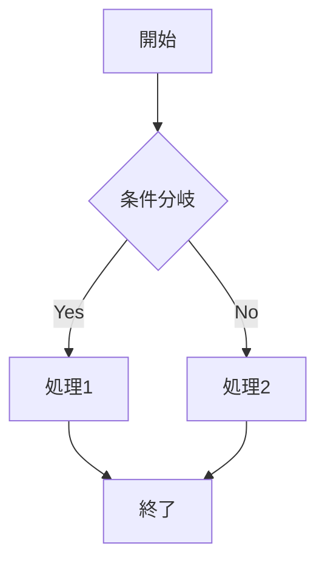
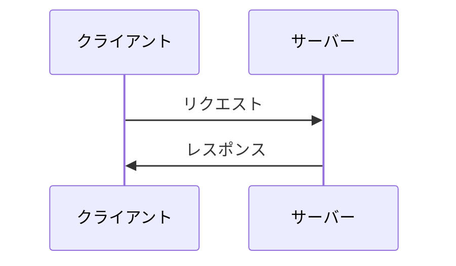
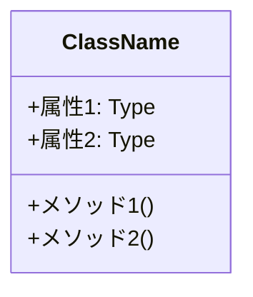
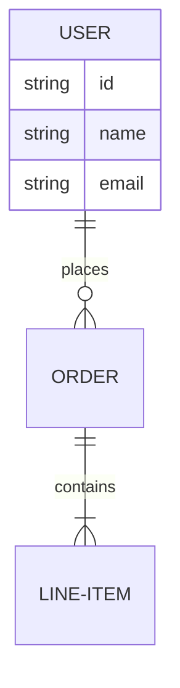
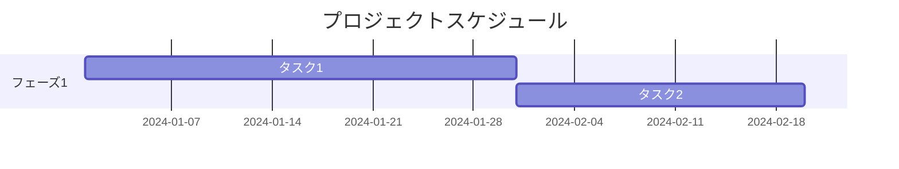

# ドキュメント共通フォーマット

すべての設計ドキュメントで使用する共通フォーマットの定義です。

## 基本構造

各ドキュメントは以下の基本構造に従います:

```markdown
# [ドキュメントタイトル]

## ドキュメント情報
- **作成日**: YYYY-MM-DD
- **最終更新日**: YYYY-MM-DD
- **バージョン**: X.Y.Z
- **作成者**: [作成者名]
- **ステータス**: [Draft/Review/Approved/Deprecated]

## 目次
[自動生成または手動で記載]

## 1. 概要
[このドキュメントの目的と範囲を簡潔に説明]

## 2. [メインセクション1]
[内容]

## 3. [メインセクション2]
[内容]

## 変更履歴
| バージョン | 日付 | 変更者 | 変更内容 |
|-----------|------|--------|----------|
| 1.0.0     | YYYY-MM-DD | [名前] | 初版作成 |

## 関連ドキュメント
- [関連ドキュメント名](リンク)
```

## セクション別ガイドライン

### ドキュメント情報セクション

必須項目:
- **作成日**: ドキュメントの初版作成日
- **最終更新日**: 最後に更新された日付
- **バージョン**: セマンティックバージョニング形式 (Major.Minor.Patch)
- **作成者**: ドキュメント作成責任者
- **ステータス**: 現在の承認状態

任意項目:
- **レビュー担当者**: レビュアーのリスト
- **承認者**: 承認権限者
- **対象読者**: 想定読者層
- **前提知識**: 読者に求められる前提知識

### 概要セクション

以下の内容を含めること:
1. ドキュメントの目的
2. 対象範囲 (スコープ)
3. 対象外の事項 (Out of Scope)
4. 用語定義 (必要に応じて)

### メインコンテンツ

ドキュメントの種類に応じて適切なセクションを配置:
- 見出しは階層的に整理 (H2, H3, H4を適切に使用)
- 各セクションは独立して理解できるように記述
- 長いセクションは適宜サブセクションに分割

### 変更履歴セクション

- 新しい変更を上に追加
- セマンティックバージョニングに従う:
  - Major: 大規模な変更、互換性のない変更
  - Minor: 機能追加、後方互換性のある変更
  - Patch: バグ修正、軽微な修正

### 関連ドキュメントセクション

- 関連する他のドキュメントへのリンクを記載
- リンク切れを防ぐため、相対パスを使用
- 依存関係の強い順に並べる

## 表記規則

### 見出し

- H1 (`#`): ドキュメントタイトルのみ (1回だけ使用)
- H2 (`##`): 主要セクション
- H3 (`###`): サブセクション
- H4 (`####`): 詳細項目 (多用しない)

### リスト

**箇条書き**:
```markdown
- 項目1
- 項目2
  - サブ項目2-1
  - サブ項目2-2
```

**番号付きリスト**:
```markdown
1. 手順1
2. 手順2
3. 手順3
```

### テーブル

```markdown
| ヘッダー1 | ヘッダー2 | ヘッダー3 |
|----------|----------|----------|
| データ1   | データ2   | データ3   |
| データ4   | データ5   | データ6   |
```

### コードブロック

言語を指定してシンタックスハイライトを有効化:

````markdown
```python
def hello_world():
    print("Hello, World!")
```
````

### 引用

```markdown
> 重要な引用や注意事項はここに記載します。
```

### 強調

- **太字**: `**重要な用語**` または `__重要な用語__`
- *斜体*: `*強調したい文字*` または `_強調したい文字_`
- `インラインコード`: バッククォートで囲む

## Mermaid図の使用

### フローチャート



### シーケンス図



### クラス図



### ER図



### ガントチャート



## 注意事項とベストプラクティス

### 記述の原則

1. **明確性**: 曖昧な表現を避け、明確に記述
2. **簡潔性**: 冗長な説明を避け、必要十分な情報を提供
3. **一貫性**: 用語や表記を統一
4. **完全性**: 読者が必要とする情報をすべて含める
5. **保守性**: 更新しやすい構造を維持

### アクセシビリティ

- スクリーンリーダー対応のため、画像には代替テキストを提供
- リンクは意味のあるテキストにする (「こちら」などは避ける)
- 色だけに依存した情報伝達を避ける

### バージョン管理

- Gitで管理しやすいよう、1行を適切な長さに保つ
- 大きな変更は段階的にコミット
- コミットメッセージは変更内容を明確に記載

### レビュープロセス

1. **自己レビュー**: 提出前に自分で読み返す
2. **ピアレビュー**: 同僚にレビューを依頼
3. **承認**: 承認者による最終確認
4. **公開**: ステータスを "Approved" に変更

## チェックリスト

ドキュメント作成時の確認項目:

- [ ] ドキュメント情報セクションがすべて記入されている
- [ ] 概要セクションで目的と範囲が明確に説明されている
- [ ] 見出しが階層的に整理されている
- [ ] 用語が一貫して使用されている
- [ ] コードブロックに言語指定がされている
- [ ] 図表に適切な説明が付けられている
- [ ] リンクがすべて有効である
- [ ] 誤字脱字がない
- [ ] 変更履歴が更新されている
- [ ] 関連ドキュメントへのリンクが記載されている

## テンプレートファイル

実際に使用可能なテンプレートファイル: [template_base.md](./template_base.md)
