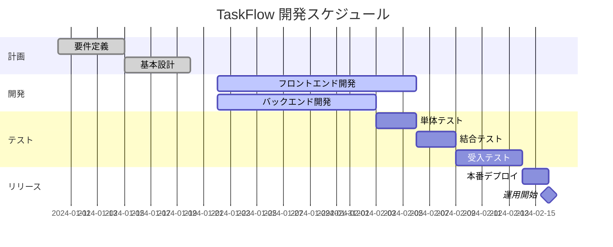

# プロジェクト概要書 - タスク管理アプリ「TaskFlow」

## ドキュメント情報

- **作成日**: 2024-01-10
- **最終更新日**: 2024-01-15
- **バージョン**: 1.1.0
- **作成者**: 田中太郎（フリーランス開発者）
- **プロジェクト**: TaskFlow - シンプルなタスク管理アプリ
- **ステータス**: Approved

## 目次

- [1. プロジェクト概要](#1-プロジェクト概要)
- [2. プロジェクト目標](#2-プロジェクト目標)
- [3. スコープ](#3-スコープ)
- [4. ステークホルダー](#4-ステークホルダー)
- [5. 見積もりと費用](#5-見積もりと費用)
- [6. スケジュール](#6-スケジュール)
- [7. 納品物と完了条件](#7-納品物と完了条件)
- [8. 技術スタック](#8-技術スタック)
- [9. リスクと前提条件](#9-リスクと前提条件)
- [10. 保守・サポート](#10-保守サポート)
- [変更履歴](#変更履歴)
- [関連ドキュメント](#関連ドキュメント)

## 1. プロジェクト概要

### 1.1 プロジェクト名

**TaskFlow（タスクフロー）** - 個人・小規模チーム向けタスク管理Webアプリケーション

### 1.2 背景

クライアント企業（株式会社ABC）では、現在Excelやスプレッドシートでタスク管理を行っているが、以下の課題がある：
- リアルタイムでの共有が困難
- タスクの進捗状況が把握しにくい
- 期限切れタスクの通知機能がない
- モバイルからのアクセスがしにくい

### 1.3 目的

シンプルで使いやすいタスク管理アプリを開発し、チームの生産性を向上させる。

### 1.4 対象ユーザー

- **主要ユーザー**: 小規模チーム（5-10人）のビジネスパーソン
- **想定利用シーン**: 日常的なタスク管理、プロジェクト進捗管理
- **デバイス**: PC（主）、スマートフォン（補助）

## 2. プロジェクト目標

### 2.1 ビジネス目標

- 社内のタスク管理業務を効率化し、生産性を20%向上
- 期限切れタスクを80%削減
- 3ヶ月以内にチーム全員が日常的に利用

### 2.2 技術目標

- レスポンシブデザインでPC・スマホ両対応
- 初期表示3秒以内（Lighthouse Performance 90点以上）
- 99%の稼働率を実現

### 2.3 成功基準

- [ ] 全チームメンバー（10人）がアカウント登録完了
- [ ] 月間アクティブユーザー率80%以上
- [ ] タスク完了率が導入前比で30%向上
- [ ] ユーザー満足度アンケートで平均4.0点以上（5点満点）

## 3. スコープ

### 3.1 含まれる機能（In Scope）

#### 3.1.1 認証機能
- メールアドレスとパスワードでのログイン
- パスワードリセット機能
- ユーザープロフィール管理

#### 3.1.2 タスク管理機能
- タスクの作成・編集・削除
- タスクのステータス管理（未着手、進行中、完了）
- 優先度設定（高、中、低）
- 期限設定
- タグ付け

#### 3.1.3 検索・フィルター機能
- タスク名での検索
- ステータス・優先度・タグでのフィルタリング
- 期限順・優先度順でのソート

#### 3.1.4 通知機能
- 期限1日前のメール通知
- 期限当日の通知

### 3.2 含まれない機能（Out of Scope）

- ❌ チーム間の共有機能（Phase 2で検討）
- ❌ ガントチャート表示（Phase 2で検討）
- ❌ ファイル添付機能（Phase 2で検討）
- ❌ カレンダー連携（Phase 2で検討）
- ❌ モバイルアプリ（Web版のみ）

## 4. ステークホルダー

### 4.1 クライアント

| 役割 | 氏名 | 責任範囲 | 連絡先 |
|------|------|----------|--------|
| プロジェクトオーナー | 山田花子 | 要件決定、予算承認 | yamada@abc.co.jp |
| 実際のユーザー代表 | 佐藤次郎 | 要件フィードバック、受入テスト | sato@abc.co.jp |

### 4.2 開発チーム

| 役割 | 氏名 | 責任範囲 |
|------|------|----------|
| フルスタック開発 | 田中太郎（私） | 全工程（設計、開発、テスト、デプロイ） |

## 5. 見積もりと費用

### 5.1 開発費用

| 項目 | 工数 | 単価 | 金額 | 備考 |
|------|------|------|------|------|
| 要件定義・設計 | 20時間 | ¥8,000/h | ¥160,000 | ER図、画面設計含む |
| フロントエンド開発 | 40時間 | ¥8,000/h | ¥320,000 | Next.js実装 |
| バックエンド開発 | 30時間 | ¥8,000/h | ¥240,000 | API、DB設計含む |
| テスト | 10時間 | ¥8,000/h | ¥80,000 | 単体・結合テスト |
| デプロイ・調整 | 10時間 | ¥8,000/h | ¥80,000 | Vercel/Railwayセットアップ |
| **合計** | **110時間** | - | **¥880,000** | |

**値引き後総額**: **¥800,000**（初回取引のため10%割引適用）

### 5.2 インフラ費用（月額）

| 項目 | サービス | 金額 | 備考 |
|------|----------|------|------|
| フロントエンドホスティング | Vercel Pro | $20/月 | カスタムドメイン対応 |
| バックエンド・DB | Railway | $5-10/月 | 使用量に応じて変動 |
| ドメイン | お名前.com | ¥100/月 | .jpドメイン |
| **合計** | - | **約¥3,500/月** | |

**初年度総額**: 約¥42,000

### 5.3 支払い条件

- **着手金**: 30%（¥240,000） - 契約時
- **中間金**: 40%（¥320,000） - 開発完了時（テスト前）
- **最終金**: 30%（¥240,000） - 納品・検収完了時

**支払期限**: 各請求書発行から30日以内

## 6. スケジュール

### 6.1 マイルストーン

### 6.2 詳細スケジュール

| フェーズ | 開始日 | 終了日 | 期間 | 成果物 |
|---------|--------|--------|------|--------|
| 要件定義 | 2024-01-10 | 2024-01-15 | 5日 | 要件定義書 |
| 基本設計 | 2024-01-15 | 2024-01-20 | 5日 | システム設計書、DB設計書 |
| 開発 | 2024-01-22 | 2024-02-06 | 15日 | 実装コード |
| テスト | 2024-02-07 | 2024-02-14 | 7日 | テスト報告書 |
| デプロイ・調整 | 2024-02-15 | 2024-02-17 | 2日 | 本番環境 |
| 受入・納品 | 2024-02-18 | 2024-02-23 | 5日 | 納品完了 |

**プロジェクト期間**: 約1.5ヶ月（2024年1月10日 〜 2024年2月23日）

### 6.3 週次ミーティング

- **頻度**: 毎週金曜日 15:00-15:30（30分）
- **形式**: オンライン（Zoom）
- **内容**: 進捗報告、課題共有、次週の予定確認

## 7. 納品物と完了条件

### 7.1 納品物

1. **アプリケーション本体**
   - 本番環境URL: https://taskflow.example.com
   - ソースコード（GitHubプライベートリポジトリ）

2. **ドキュメント**
   - 要件定義書
   - システム設計書
   - データベース設計書
   - API仕様書
   - 運用手順書
   - ユーザーマニュアル

3. **テスト関連**
   - テスト計画書
   - テストケース仕様書
   - テスト報告書

### 7.2 完了条件

- [ ] すべての機能が要件定義書通りに実装されている
- [ ] 受入テストですべてのテストケースが合格
- [ ] Lighthouse Performanceスコアが90点以上
- [ ] セキュリティ診断でCritical/Highの脆弱性がゼロ
- [ ] すべてのドキュメントが納品されている
- [ ] クライアント担当者による動作確認が完了
- [ ] 本番環境が安定稼働（24時間エラーなし）

### 7.3 受入基準

- タスクの作成・編集・削除が正常に動作
- 検索・フィルター機能が正常に動作
- メール通知が正常に送信される
- PC・スマートフォンで正常に表示される
- 10人が同時にアクセスしても正常に動作

## 8. 技術スタック

### 8.1 フロントエンド

- **フレームワーク**: Next.js 14（App Router）
- **言語**: TypeScript
- **スタイリング**: Tailwind CSS
- **状態管理**: Zustand
- **フォーム**: React Hook Form + Zod

### 8.2 バックエンド

- **ランタイム**: Node.js 20
- **フレームワーク**: Next.js API Routes
- **認証**: NextAuth.js（JWT）
- **ORM**: Prisma
- **メール送信**: Resend

### 8.3 データベース

- **種類**: PostgreSQL 15
- **ホスティング**: Supabase（無料枠）

### 8.4 インフラ

- **フロントエンド**: Vercel
- **バックエンド**: Vercel（同一）
- **ドメイン**: お名前.com
- **監視**: Vercel Analytics

## 9. リスクと前提条件

### 9.1 リスク

| リスク | 影響度 | 発生確率 | 対策 |
|--------|--------|----------|------|
| 要件の大幅変更 | 高 | 中 | 週次MTGで早期に検知、変更管理プロセスを明確化 |
| 第三者サービスの障害 | 中 | 低 | Vercel/Supabaseの稼働率を事前確認、代替案を準備 |
| スケジュール遅延 | 高 | 中 | バッファを確保、優先度の低い機能は延期可能にする |
| セキュリティ脆弱性 | 高 | 低 | OWASP Top 10対策を実施、定期的な脆弱性スキャン |

### 9.2 前提条件

- クライアントからのフィードバックが週次MTG時に得られること
- 本番環境のドメイン取得はクライアント側で実施
- 本番環境の費用（月額約¥3,500）はクライアント負担
- メール送信にクライアントのSMTPサーバーを使用可能（または Resend 使用）

### 9.3 制約事項

- 開発は1人体制のため、並行作業に限界がある
- 無料枠を活用するため、大規模なトラフィックには対応できない（月間1,000ユーザーまで）
- モバイルアプリ（iOS/Android）は対象外

## 10. 保守・サポート

### 10.1 保守契約（オプション）

**月額**: ¥30,000

**含まれる内容**:
- 月4時間までの軽微な修正・機能改善
- メール・Slackでの技術サポート（平日10:00-18:00）
- 月次でのシステム稼働レポート
- セキュリティアップデート対応

**含まれない内容**:
- 新機能の追加（別途見積もり）
- 第三者サービスの障害対応
- 大幅なデザイン変更（別途見積もり）

### 10.2 無償保証期間

納品後**1ヶ月間**は無償でバグ修正対応

## 変更履歴

| バージョン | 日付 | 変更者 | 変更内容 |
|-----------|------|--------|----------|
| 1.0.0     | 2024-01-10 | 田中太郎 | 初版作成 |
| 1.1.0     | 2024-01-15 | 田中太郎 | クライアントフィードバックを反映、スケジュールを調整 |

## 関連ドキュメント

- [要件定義書](../01_planning/requirements_specification.md)
- [システム設計書](../02_design/system_design.md)
- [データベース設計書](../02_design/database_design.md)
- [API仕様書](../02_design/api_specification.md)
